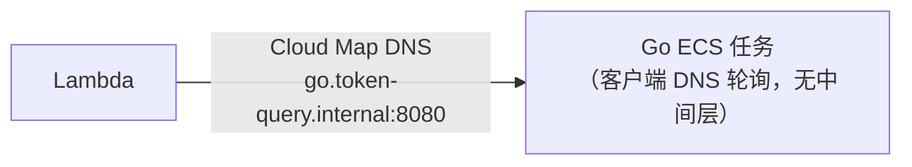
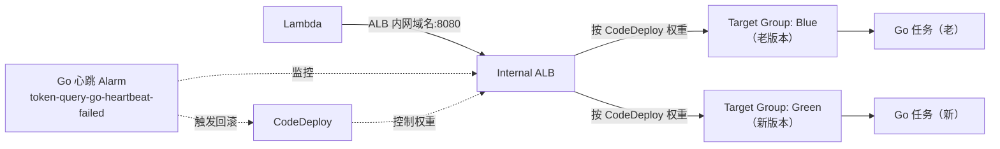

# Go/ECS 灰度发布（ALB + CodeDeploy Blue/Green）实施计划

**状态：纯计划文档，还没有开始执行任何一步。** 跟 Worker 那次（[gradual-rollout-canary-deployment.md](gradual-rollout-canary-deployment.md) 里"Free plan 卡住"）类似，这是一个"想清楚了但暂不落地"的方案——引入 Internal ALB 会给项目增加约 $16-17/月的固定成本，对一个学习项目来说性价比不高（详见同一份文档里的成本结论），先把完整计划记下来，等真的需要（生产流量起来、Go 更新频繁到必须平滑切换）再回来执行。

参考对照：Lambda 那边已经走过这整套"操练 → 落地 → 验证"的完整流程（[lambda-codedeploy-canary.md](lambda-codedeploy-canary.md) + [lambda-canary-architecture-upgrade.md](lambda-canary-architecture-upgrade.md)），这份文档结构照抄那个节奏，只是提前把 Part 1 和 Part 2 都规划完，还没有真的动手。

## 架构对比

**现在**：


**接入 ALB 之后**：


## Part 1 — 业务无关操练

跟 SNS/SQS/EventBridge/Lambda 那几次一样，先用跟 token-query 完全无关的一套资源练一遍 ECS Blue/Green 机制，不直接碰 `go-stack.ts`。为了不用重新搭一个 VPC，**复用现有 `token-query-vpc` 的私有子网**，但所有新建资源都用 `learning-` 前缀命名，练完整体删除。

### 步骤

- [ ] 1. 建一个最简单的测试容器镜像（不用编译 Go，直接用现成镜像）
  - 用 AWS 官方 ECS 示例镜像 `public.ecr.aws/docker/library/nginx:latest`，或者随便一个能返回不同响应体、区分版本的静态镜像
  - 更省事的做法：用一个能通过环境变量控制返回内容的镜像（比如 `hashicorp/http-echo`），Task Definition 里传 `-text="v1"`，第二个 Task Definition 传 `-text="v2"`，这样能像 Lambda 操练那次一样直接从响应体分辨版本
- [ ] 2. 建一个测试用 ECS Cluster（或者复用现有的 `token-query-cluster`，反正只是加了几个新 Service，不影响 Go 的正式 Service）
- [ ] 3. 建 Internal ALB + 两个 Target Group
  - ALB：Internal，放现有私有子网，新建一个 `learning-alb-sg` 安全组（入站放行来自你本机测试用的来源，比如 VPC 内部或者临时开一个内网测试点）
  - Target Group ×2：`learning-tg-blue`、`learning-tg-green`，类型 `ip`，端口对齐容器端口，健康检查路径按镜像实际情况定
  - Listener：监听一个端口（比如 80），初始转发到 `learning-tg-blue`
- [ ] 4. 建 ECS Service，`DeploymentController: CODE_DEPLOY`
  - Task Definition 用 v1 镜像/参数
  - Service 关联 ALB（`LoadBalancers` 指向 blue Target Group），**不要**关联 Cloud Map（练习阶段用不上）
- [ ] 5. 建 CodeDeploy Application（compute platform: ECS）+ Deployment Group
  - 关联这个 ECS Service、ALB Listener、Blue/Green 两个 Target Group
  - 部署策略选 `CodeDeployDefault.ECSCanary10Percent5Minutes`
  - 先不挂 Alarm（跟 Lambda 操练一样，回滚验证单独作为一步）
- [ ] 6. 手动触发一次 Blue/Green 部署（v1 → v2）
  - 注册一个新的 Task Definition revision（v2 镜像/参数）
  - 拼 AppSpec，指定新 Task Definition + 容器名/端口 + 两个 Target Group
  - `aws deploy create-deployment` 触发
- [ ] 7. 观察灰度过程
  - 部署中反复请求 ALB 的域名，观察响应体在 v1/v2 之间按比例分布
  - 确认 CodeDeploy 部署详情页能看到 "Test traffic" / "Reroute traffic" 这些 Blue/Green 特有的阶段（这是跟 Lambda Canary 不一样的地方——ECS Blue/Green 是"整个新 Task Set 起来 → 切一部分流量 → 观察 → 全切或回滚"，不是像 Lambda 那样纯粹靠 Alias 权重）
- [ ] 8. 验证自动回滚
  - 建一个简单的测试 Alarm，挂到 Deployment Group（别忘了 Lambda 操练踩过的坑：**Alarm Configuration 有独立的 `enabled` 总开关**，这里大概率是同一套机制，同样容易漏）
  - 重新触发一次部署，中途手动把 Alarm 打成 `ALARM`，确认 CodeDeploy 自动停止部署、流量切回 Blue
- [ ] 9. 练完清理
  - 删 CodeDeploy Deployment Group + Application
  - 删 ECS Service + Task Definition + Cluster（如果是新建的）
  - 删 ALB + 两个 Target Group + `learning-alb-sg`
  - 删测试 Alarm

## Part 2 — 实际部署到 `go-stack.ts`（等真的需要时再执行）

### 需要改动的资源

| 资源 | 改动 |
|---|---|
| ALB | 新增：Internal 类型，放现有私有子网 |
| Target Group ×2 | 新增：Blue/Green，类型 `ip`，端口 8080 |
| ALB 安全组 | 新增：`Lambda SG → ALB SG → Go SG` 三层放行链，替换现在的 `Lambda SG → Go SG` 直连 |
| `GoService`（`CfnService`） | 改：`deploymentController: { type: "CODE_DEPLOY" }`，`loadBalancers` 指向 Blue Target Group（初始），评估要不要保留 `serviceRegistries`（Cloud Map）——可以两者并存，但 Lambda 调用目标要切到 ALB |
| CodeDeploy Application + Deployment Group | 新增：`codedeploy.EcsApplication` + `codedeploy.EcsDeploymentGroup`，关联上面的 ALB Listener + 两个 Target Group，挂现有的 `token-query-go-heartbeat-failed` Alarm（[monitoring-stack.ts](../../infra/cdk/lib/monitoring-stack.ts)）做自动回滚 |
| `apps/server` 的 `GO_SERVICE_ORIGIN` | 改：从 `http://go.token-query.internal:8080`（Cloud Map）换成 ALB 的内网域名 |
| `deploy-go.yml` | **新增一整段**——见下面单独说明，这是跟 Lambda 落地时最大的不同 |

### 关键差异：ECS Blue/Green 没有 Lambda 那种自动挂钩

Lambda 落地时（[lambda-canary-architecture-upgrade.md](lambda-canary-architecture-upgrade.md)）`deploy-lambda.yml` **一行没改**，因为 CloudFormation 原生的 `UpdatePolicy: CodeDeployLambdaAliasUpdate` 会在 Alias 属性变化时自动接管。**ECS 没有这个等价机制**——`DeploymentController: CODE_DEPLOY` 模式下，`cdk deploy` 改 Task Definition 只是更新"骨架"，不会自动触发一次真实部署。`deploy-go.yml` 需要在现有的 CodeBuild 构建镜像之后，`cdk deploy token-query-go` 之外，**额外新增几步**：

```bash
# 1. 注册新的 Task Definition revision（cdk deploy 只是把定义写进模板，这一步才是真正"发布"）
aws ecs register-task-definition --cli-input-json file://task-def.json

# 2. 拼 AppSpec，指定新 Task Definition ARN + 容器名/端口 + 两个 Target Group
# 3. 显式触发 CodeDeploy
aws deploy create-deployment \
  --application-name token-query-go-app \
  --deployment-group-name token-query-go-dg \
  --revision '{"revisionType":"AppSpecContent","appSpecContent":{"content":"..."}}'

# 4. 等部署跑完（不像 Lambda 那样 cdk deploy 自己会等，这里要单独 wait）
aws deploy wait deployment-successful --deployment-id <id>
```

这是真实的额外工程量，不是配置一下就有——写 `deploy-go.yml` 的时候要留足这部分。

### 验证步骤（真正执行到这一步时用）

- [ ] `cdk diff token-query-go` 确认只有预期的资源变化（ALB/TG/安全组/DeploymentController），没有意外的资源替换（尤其注意 `DeploymentController` 类型切换是否会导致 Service 被替换重建——这个需要实际 diff 一次才能确认，CloudFormation 对某些 Service 属性变更是"就地更新"还是"替换"不一定直观）
- [ ] 手动触发一次真实的镜像更新，观察 ALB 后面 Blue/Green 两个 Target Group 的健康任务数变化
- [ ] 确认 Lambda 调 Go 的请求在灰度窗口内确实按比例分布到两个版本（可以让 Go 的 `/health` 也带一个类似 Lambda 那次的 `version` 字段，用同样的思路验证）
- [ ] 故意让 Go 心跳 canary 失败一次（比如临时改坏 `/health`），确认 CodeDeploy 真的自动回滚
- [ ] 更新 `docs/cdk-deploy-commands.md`，补充这部分的部署/清理命令，参照 Part 6/7 的记录方式

## 决策依据：什么时候值得真的做这件事

- Go 服务开始有需要平滑升级的真实生产流量（不是练习/学习性质的调用）
- Go 代码更新频率提高到"每次上线都担心把线上搞挂"的程度
- 愿意接受多花 ~$16-17/月的固定成本，以及 `deploy-go.yml` 变得更复杂这个维护成本

在这之前，[gradual-rollout-canary-deployment.md](gradual-rollout-canary-deployment.md) 里讨论过的"应用层灰度"（Lambda 侧按权重随机选 stable/canary 两个 Cloud Map 服务名，权重存 SSM 参数）是更划算的过渡方案——零额外固定成本，回滚只是改一个 SSM 参数，没有 `deploy-go.yml` 大改造的工程量。
