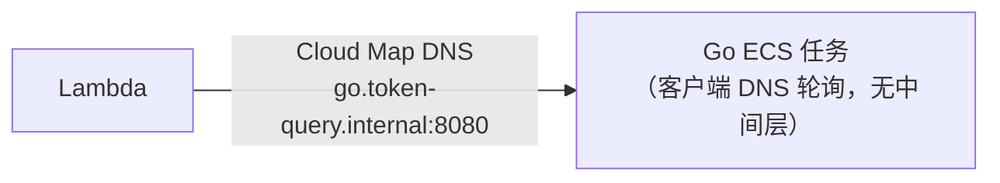
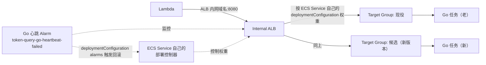

# Go/ECS 灰度发布（ALB + ECS 原生 Blue/Green）实施计划

**状态：已决定要做，这是可实施的步骤文档。** 跟最早写这份文档时（2026-07）的判断不一样了——当时的结论是"$16-17/月的 ALB 固定成本对学习项目不划算，先用零成本方案"，现在的决策依据变了：这个项目本身跑一段时间就会停掉，成本不是决定性因素；在"ALB"和"手动管理 Cloud Map 加权路由"两条路径之间，**ALB 是更通用、更少自造轮子的方案**，所以直接选它，不再纠结成本。

**这份文档相比最早那版有一次重大更新**：最早规划的是 ECS 的 **CodeDeploy Blue/Green**（`DeploymentController: CODE_DEPLOY`），需要额外建 CodeDeploy Application/Deployment Group、手写 AppSpec、`deploy-go.yml` 里手动调 `aws deploy create-deployment`。经过一轮实际查证（含直接翻项目里装的 `aws-cdk-lib@2.261.0` 源码确认），AWS 在 2025 年 7 月～2026 年 3 月给 ECS 加了一套**原生** blue/green/canary/linear 部署机制（`DeploymentController: ECS` + `deploymentConfiguration.strategy`），**不再需要 CodeDeploy**，这份文档改成走这条更新、更简单的路。

参考对照：Lambda 那边已经走过这整套"操练 → 落地 → 验证"的完整流程（[lambda-codedeploy-canary.md](lambda-codedeploy-canary.md) + [lambda-canary-architecture-upgrade.md](lambda-canary-architecture-upgrade.md)），这份文档结构照抄那个节奏。

## 几个已经查证过、不再需要重新讨论的结论

- **Service Connect 不适用**：ECS 原生 blue/green 支持 ALB / NLB / Service Connect 三选一做流量切换，但 Service Connect 的自动路由依赖调用方自己也在 Service Connect 的 sidecar 代理里——**Lambda 不是 ECS 任务，没法参与这个代理机制**，所以对"Lambda 调 Go"这个架构，Service Connect 用不上，只能选 ALB/NLB
- **ALB 成本跟 ECS 任务数量无关，只跟流量挂钩**：LCU 计费的四个维度（新建连接数、活跃连接数、处理字节数、规则评估次数）都是流量相关指标，任务/实例数量本身不是计费维度——Go 服务扩容不会让 ALB 账单变贵
- **CDK 支持已确认**：项目里装的 `aws-cdk-lib@2.261.0` 已经有完整的 L1 `CfnService` 属性支持（`deploymentController`、`deploymentConfiguration.canaryConfiguration`/`linearConfiguration`/`lifecycleHooks`/`alarms`、`loadBalancers[].advancedConfiguration.alternateTargetGroupArn`），落地到 `go-stack.ts` 不需要把整个 L1 `CfnService` 迁移成 L2

## 架构对比

**现在**：


**接入 ALB 之后（ECS 原生管理，没有 CodeDeploy 这一层）**：


关键区别：之前图里有一个独立的 "CodeDeploy" 决策框，新方案里这个决策逻辑**内建在 ECS Service 资源本身**，不再是一个外部服务。

## Part 1 — 业务无关操练

跟 SNS/SQS/EventBridge/Lambda 那几次一样，先用跟 token-query 完全无关的一套资源练一遍这套新机制，不直接碰 `go-stack.ts`。**复用现有 `token-query-vpc` 的私有子网**，所有新建资源用 `learning-` 前缀命名，练完整体删除。

这次操练全程用 **AWS CLI**，不用控制台一步步点——原因是这套原生 blue/green 机制刚推出不久，AWS 官方文档里控制台部分的好几个关键字段（部署策略选择器具体叫什么、界面长什么样）文档本身都还没有截图/展开，与其照着不完整的文档去猜控制台按钮叫什么，不如直接用有完整示例的 CLI JSON，更准确可靠。如果你在实际操作时发现控制台里有对应的图形化选项，也可以对照着切换过去，不用非 CLI 不可。

### 步骤

- [x] 1. 建一个最简单的测试容器镜像（不用编译 Go，直接用现成镜像）
  - 用 `hashicorp/http-echo` 这个镜像，Task Definition 里传 `-text="v1"`，第二个 revision 传 `-text="v2"`——这样能直接从响应体分辨版本，跟 Lambda/ECS 之前几次操练用的思路一致
  - 容器监听端口用 `5678`（`http-echo` 默认端口）
  - **前置检查（控制台）**：`hashicorp/http-echo` 是 Docker Hub 公开镜像，不是 ECR，Fargate 任务要在私有子网里拉到它必须能出网。打开 [VPC 控制台](https://console.aws.amazon.com/vpc) → 左侧 **NAT Gateways**，确认 `token-query-vpc` 对应的私有子网路由表已经指向一个 NAT Gateway。如果没有，这一步后面启动任务时会报 `CannotPullContainerError`，需要先解决出网问题再继续
  - **建 v1 Task Definition（控制台点法）**：
    - 打开 [ECS 控制台](https://console.aws.amazon.com/ecs) → 左侧 **Task definitions** → **Create new task definition** → **Create new task definition**（不是 JSON 那个入口，用图形化表单）
    - **Task definition family**：填 `learning-go-canary`
    - **Launch type**：勾选 **AWS Fargate**
    - **Operating system/Architecture**：保持默认 **Linux/X86_64**
    - **Task size**：CPU 选 **0.25 vCPU**，Memory 选 **0.5 GB**（够用，省钱）
    - **Task execution role**：选现有的执行角色（项目里应该已经有一个给 Go 服务用的，找不到的话选 **Create new role** 让控制台自动建一个默认的）
    - 往下滚到 **Container - 1** 区块：
      - **Name**：`http-echo`
      - **Image URI**：`hashicorp/http-echo`
      - **Container port**：`5678`，Protocol 选 **TCP**，Port name 留空即可
      - Command 不在 Environment variables 区块里，是单独一个折叠区：继续往下滚找到 **Docker configuration - optional**，点开后在 **Command** 输入框（逗号分隔格式，placeholder 是 `echo,hello world`）里填：`-text=v1,-listen=:5678`；**Entry point**、**Working directory** 都留空
    - 往下滚到 **Logging** 区块，保持默认勾选 **Use log collection**，Log driver 用默认的 `awslogs`，Log group 留空让它自动创建（或手动填 `/ecs/learning-go-canary`）
    - 其他区块（Volumes、Tags 等）保持默认，点右下角 **Create**
    - 建完后在 Task Definitions 列表点进 `learning-go-canary`，记下这个 revision（应该是 `learning-go-canary:1`）的 ARN，后面第 4 步 JSON 里要填
  - **建 v2 Task Definition（留到第 5 步用，做法一样）**：等实际触发灰度发布那一步时，回到 `learning-go-canary` 详情页 → 勾选当前 revision → **Create new revision**，只把 Command 里的 `-text=v1` 改成 `-text=v2`，其他都不变，点 **Create** 就会生成 `learning-go-canary:2`

- [x] 2. 建 Internal ALB + 两个 Target Group + Listener
  - 打开 [EC2 控制台](https://console.aws.amazon.com/ec2) → 左侧 **Load Balancing → Target Groups** → **Create target group**
    - Target type 选 **IP addresses**（Fargate `awsvpc` 模式下每个任务有自己的 ENI，走这个类型）
    - Target group name：`learning-tg-a`，Protocol/Port：`HTTP` / `5678`，VPC 选现有的 `token-query-vpc`
    - Health check path 填 `/`（`http-echo` 对任何路径都返回配置的文本，用根路径就行）
    - 建完这一个后，原样再建一次，名字改成 `learning-tg-b`——这两个 Target Group 就是后面"现役/候选"两个槽位
  - 左侧 **Load Balancers** → **Create load balancer** → 选 **Application Load Balancer**
    - Name：`learning-go-canary-alb`，Scheme 选 **Internal**（不对公网开放）
    - VPC 选 `token-query-vpc`，Mappings 里勾选现有的私有子网——**要跟后面第 4 步 ECS Service 用的子网可用区完全对齐**（这个项目私有子网跨 `us-west-2a`/`b`/`c` 三个可用区，就三个都勾上，别漏）。踩过的坑：一开始只勾了两个可用区，Service 的任务子网却是三个可用区，Fargate 偶尔把任务调度到 ALB 没覆盖的那个可用区，健康检查必然失败，ECS 会检测到并自动替换任务（不算致命但徒增一次不必要的任务重启），事后用 `aws elbv2 set-subnets` 把第三个可用区补上就解决了
    - Security group：新建一个 `learning-alb-sg`，入站规则先放行 VPC 内部网段（比如 `10.0.0.0/16`，具体按你的 VPC CIDR），端口 80，方便操练阶段直接从 VPC 内测试
    - Listener：HTTP : 80，Default action 先指向 `learning-tg-a` → **Create load balancer**
  - 记下这个 ALB 的 ARN、这条 Listener 的 ARN、两个 Target Group 的 ARN——下面第 4 步的 JSON 里要填
  - **另建一个任务用的安全组（第 4 步 Networking 会用到，容易漏）**：`learning-alb-sg` 只是给 ALB 用的，Go 任务本身需要一个独立的安全组
    - EC2 控制台 → **Security Groups** → **Create security group**
    - **Name**：`learning-go-task-sg`，**VPC**：`token-query-vpc`
    - **Inbound rules**：Type 选 **Custom TCP**，Port range `5678`，Source 选 **Custom**，直接选安全组 `learning-alb-sg` 作为来源（不是填 CIDR）——意思是只放行 ALB 转发过来的流量，比放行整个 VPC 网段更贴近生产做法
    - **Outbound rules**：保持默认 Allow all outbound（任务需要出网拉 Docker Hub 镜像）

- [x] 3. 建一个测试用 ECS Cluster（或者复用现有的 `token-query-cluster`，反正只是加了几个新 Service，不影响 Go 的正式 Service）

- [x] 4. 建 ECS Service，走原生 blue/green（**控制台已经支持图形化配置 Canary**，实测可以不用 CLI，下面先记控制台点法，CLI JSON 留作备用/对照）
  - **控制台点法（ECS 控制台 → Cluster → Services → Create）**：
    - **Compute options**：Launch type 选 **Fargate**
    - **Deployment configuration**：Task definition family 选 `learning-go-canary`，Revision 选 v1 那个；Service name 填 `learning-go-canary-service`；**Desired tasks 改成 `2`**（默认是 1，要手动改）；Health check grace period 保持 `0`
    - **Networking**：VPC 选 `token-query-vpc`，子网选私有子网，安全组选任务用的那个，Public IP 关闭
    - **Load balancing**：
      - Load balancer type 选 **Application Load Balancer**，Use an existing load balancer 选 `learning-go-canary-alb`
      - Container to load balance 选 `http-echo:5678`
      - **Listener**：选 **Use an existing listener**，选步骤2建的 HTTP:80 那条
      - **Target group**：Option 选 **Use two existing target groups**；Target group（生产/蓝）选 `learning-tg-a`；**Green target group（候选/绿）选 `learning-tg-b`**
      - ⚠️ **踩坑点**：Green target group 下拉框如果显示 `learning-tg-b` 是灰色不可选，理由是 "The target group is not associated with any load balancers"——这个向导要求 Green Target Group 必须**先关联到这个 ALB 的某条 Listener 规则下**才能被选中，光建了 Target Group 不够。解决办法：去 EC2 控制台 → Load Balancers → `learning-go-canary-alb` → Listeners → HTTP:80 → **Manage rules** → 新增一条规则，随便给个不会被真实访问到的匹配条件（比如 Path is `/__green-test*`），Action 选 **Forward to target groups** → `learning-tg-b`（Weight 1，100%），保存。建完规则后**刷新页面或重新打开 Create Service 向导**（之前填的字段不会保留，要重填），Green target group 下拉框里 `learning-tg-b` 才会变成可选状态（可能有几十秒的传播延迟）
    - **Deployment options**（在 Load balancing 下面）：
      - Deployment controller type：`ECS`（固定，不用改）
      - Deployment strategy：选 **Canary**
      - 展开后的三个字段容易和文档 CLI JSON 的参数名对不上，对应关系：
        | 控制台字段 | 对应 CLI JSON 参数 | 填的值 |
        |---|---|---|
        | Canary percent | `canaryConfiguration.canaryPercentage` | `10` |
        | Canary bake time | `canaryConfiguration.canaryInterval` | `3` |
        | Deployment bake time | 顶层 `bakeTimeInMinutes` | `5` |
      - Min running tasks % / Max running tasks %：保持默认 `100` / `200`
    - **Deployment failure detection**：
      - Use the Amazon ECS deployment circuit breaker：保持勾选（跟 CloudWatch Alarm 回滚是两套独立机制，可以共存，多一层安全网）
      - Rollback on failures：保持勾选
      - Threshold type/value：保持默认 Bounded percentage of desired count / `50`
      - **Use CloudWatch alarm(s)：先不要勾**——对应 CLI JSON 里 `deploymentConfiguration.alarms`，需要的测试 Alarm（`learning-go-canary-test-alarm`）要到步骤7才建，现在勾了也选不到。等做到步骤7验证自动回滚时，回这个 Service 的 **Update** 页面里补勾这个选项
    - 确认无误后点 **Create**
  - **CLI 备用做法（对照 AWS 官方例子改的，控制台走不通时用这个）**：
  - 先注册第一版 Task Definition（v1 镜像/参数），拿到 Task Definition ARN
  - 写一个 `service-definition.json`：
    ```json
    {
      "serviceName": "learning-go-canary-service",
      "cluster": "{{你的cluster ARN}}",
      "taskDefinition": "{{v1 Task Definition ARN}}",
      "desiredCount": 2,
      "launchType": "FARGATE",
      "networkConfiguration": {
        "awsvpcConfiguration": {
          "subnets": ["{{私有子网1}}", "{{私有子网2}}"],
          "securityGroups": ["{{learning-alb-sg 或另建一个任务用的安全组}}"],
          "assignPublicIp": "DISABLED"
        }
      },
      "deploymentController": { "type": "ECS" },
      "deploymentConfiguration": {
        "strategy": "CANARY",
        "bakeTimeInMinutes": 5,
        "canaryConfiguration": {
          "canaryInterval": 3,
          "canaryPercentage": 10
        }
      },
      "loadBalancers": [
        {
          "targetGroupArn": "{{learning-tg-a 的 ARN}}",
          "containerName": "http-echo",
          "containerPort": 5678,
          "advancedConfiguration": {
            "alternateTargetGroupArn": "{{learning-tg-b 的 ARN}}",
            "productionListenerRule": "{{Listener 的 ARN（不是 Rule，默认监听器直接用 Listener ARN 即可，具体以实际 create-service 报错提示为准）}}"
          }
        }
      ]
    }
    ```
    - `deploymentConfiguration.strategy` 选 **`CANARY`**（不是 `BLUE_GREEN`）——这样第一次切流量只会给新版本 10%，隔 3 分钟再切剩下的 90%，验证效果的时候能像 Lambda 那次一样看到"10% 概率是 v2"这个中间状态，比 `BLUE_GREEN` 直接整体切更适合拿来对比理解
  - `aws ecs create-service --cli-input-json file://service-definition.json`

- [x] 5. 触发一次真实的灰度发布（v1 → v2）
  - **前提**：Service 现在得先稳定跑在 `learning-go-canary:1`（v1）上，再触发切到 `:2`（v2），这样才能观察到有意义的 v1→v2 过渡过程；`learning-go-canary:2` 这个 revision 前面步骤1已经建好了，不用重建
  - **控制台点法（推荐）**：
    - ECS 控制台 → 进 `learning-go-canary-cluster` → **Services** 标签 → 点进 `learning-go-canary-service`
    - 右上角 **Update service**
    - **Task definition revision** 选成 `2 (latest)`（也就是 v2）
    - 其他字段（Desired tasks、Deployment options 里的 Canary/Bake time 参数、Load balancing 等）**全部保持不动**——这次操练最重要的验证点就是：**只改 Task definition revision 这一个字段，不碰任何 Deployment 相关配置**，看它是不是自己就能触发完整的 canary 流程
    - 底部**不要勾** "Force new deployment"（这个是给"镜像 tag 没变但想强制重启"用的，这次是 revision 真的变了，不需要它）
    - 点 **Update**
  - **验证要点**：确认光是切换 Task definition revision（不管是控制台点，还是背后对应的 CLI `update-service --task-definition`）就会触发完整的 blue/green 流程（新建候选 Task Set → 切 10% 流量 → 等 3 分钟 → 切剩余 90% → bake 5 分钟 → 终止旧 Task Set），**不需要**再额外调用类似 CodeDeploy 那种 `create-deployment` 命令——这跟老的 CodeDeploy 方案是本质区别，务必实际跑一遍确认，不要假设
  - **CLI 备用做法**：`aws ecs update-service --cluster learning-go-canary-cluster --service learning-go-canary-service --task-definition learning-go-canary:2 --region us-west-2`

- [x] 6. 观察灰度过程（点了 Update 之后怎么验收）
  - **控制台看进度（推荐）**：
    - ECS 控制台 → Service 详情页 → **Deployments** 标签：能看到新旧两个 deployment 并排列出来，每个都有自己的 `Rollout state`（`IN_PROGRESS`/`COMPLETED`）、Desired/Running/Pending 任务数、创建时间；这里能直观看到"旧 deployment 状态变成 INACTIVE 之前，新 deployment 先经历 IN_PROGRESS→COMPLETED"这个过程
    - 同一个页面的 **Events** 标签（或者 Deployments 标签下方）：会有一条条时间戳日志，比如 "has started 1 tasks"、"registered N targets in (target-group ...)"、"has reached a steady state" 这种，能看出来 canary 分几个阶段推进——这个跟 CLI `describe-services` 返回的 `events` 数组是同一份数据，控制台看更方便
    - EC2 控制台 → Target Groups → 分别点进 `learning-tg-a`、`learning-tg-b` → **Targets** 标签：能看到各自当前挂了几个 healthy 任务，配合刷新按钮，能看到任务数从"一个组 2 个、另一个组 0 个"过渡到"两个组各有一部分"再到"完全切到新的那个组"——这是最直观能看到 10%→100% 切流过程的地方
    - EC2 控制台 → Load Balancers → `learning-go-canary-alb` → Listeners → 对应 Listener → **Rules**：点进那条被 ECS 接管的 production rule，能看到 `Forward to target groups` 里两个 Target Group 的 **Weight** 实时变化（比如从 `tg-a: 100 / tg-b: 0` 过渡到 `tg-a: 90 / tg-b: 10` 再到 `tg-a: 0 / tg-b: 100`）——这是控制台里唯一能直接看到"权重数字"的地方，最接近 CLI JSON 里 canary 参数的直观体现
  - **CLI 备用/交叉验证**：`aws ecs describe-services --cluster learning-go-canary-cluster --services learning-go-canary-service --region us-west-2` 反复查，观察 `deployments` 数组里新旧两个 deployment 的 `rolloutState`/状态变化
  - **实际请求验证**：部署过程中用 VPC 内的一台机器（或者临时开个测试端点）反复 `curl http://<ALB 内网 DNS>/`，观察响应体在 v1/v2 之间从"几乎全 v1"过渡到"10% v2"再到"全 v2"——这是唯一能验证"客户端实际感知到的流量比例"是否符合预期的方法，光看控制台数字不够，得真的发请求
  - 两个 Target Group 各自的健康任务数变化（CLI 版）：`aws elbv2 describe-target-health --target-group-arn {{tg-a/tg-b}}`

- [x] 7. 验证自动回滚
  - 建一个简单的测试 Alarm（随便一个能手动 `set-alarm-state` 打成 ALARM 的），把它的 ARN 加进 `deploymentConfiguration.alarms`：
    ```json
    "alarms": { "alarmNames": ["learning-go-canary-test-alarm"], "enable": true, "rollback": true }
    ```
  - 重新走一次第 5 步的发布流程，中途手动 `aws cloudwatch set-alarm-state --alarm-name learning-go-canary-test-alarm --state-value ALARM`，确认 ECS 自动停止部署、流量切回旧版本
  - **别忘了 Lambda 操练时踩过的坑**：确认 `alarms.enable` 是不是独立开关，光把 Alarm 名字加进列表不一定生效，这一点上次在 Lambda CodeDeploy 那次是真的踩过（[lambda-codedeploy-canary.md](lambda-codedeploy-canary.md)），这次机制变了不一定还有同样的坑，但验证的时候留意一下

- [ ] 8.（可选加分项）验证 Deployment Lifecycle Hook
  - 建一个最简单的 Lambda（收到调用直接返回成功），把它配置成 `PRE_SCALE_UP` 阶段的 hook：
    ```json
    "lifecycleHooks": [
      {
        "hookTargetArn": "{{测试 Lambda ARN}}",
        "roleArn": "{{允许 ECS 调用这个 Lambda 的角色}}",
        "lifecycleStages": ["PRE_SCALE_UP"]
      }
    ]
    ```
  - 再触发一次部署，确认这个 Lambda 真的在候选 Task Set 起来之前被调用了一次（看它自己的 CloudWatch Logs）——这个机制以后可以用来在灰度过程中插入自定义校验逻辑（比如调用 Go 的一个内部自检接口），不是这次的重点，练一下知道有这个能力就行

- [ ] 9. 练完清理
  - 删 ECS Service（`desired-count` 先降到 0 再删，或者直接 `delete-service --force`）
  - 删 Task Definition（deregister 各个 revision）
  - 删 ALB + 两个 Target Group + `learning-alb-sg`
  - 删测试 Alarm、测试 Lambda（如果做了第 8 步）
  - 删 ECS Cluster（如果是新建的）

### 练完自查

- [x] 确认"光 `update-service` 换一个新 Task Definition 就能触发完整 blue/green 流程"这件事是不是真的（这是这次操练最关键的结论，直接决定 Part 2 里 `deploy-go.yml` 到底要不要改）
  - **确认为真，但分两层，缺一层会误解结论**：
    1. **一次性基础设施**：Service 得先带上 `deploymentController: ECS` + `deploymentConfiguration`（strategy/canary参数/alarms）+ `loadBalancers[0].advancedConfiguration`（两个 Target Group + 两条 Listener Rule 的 ARN）——这些是建 Service 时写死的，属于 `go-stack.ts`（CDK）的改动范围，不是每次发布都要重新声明
    2. **每次发布的触发动作**：只要上面这层基础设施已经就位，之后每次发布真的**只需要**换 Task Definition revision 再 `update-service`（或控制台点 Update service），完整的"新建候选 Task Set → 注册 Target Group → canary 切流量 → bake time → 终止旧 Task Set"全部自动触发，全程没有调用过任何类似 CodeDeploy `create-deployment` 的额外命令
  - **实测证据**（本次操练里真实触发过 4 次部署，都只调了 `update-service`，Cluster `learning-go-canary-cluster` / Service `learning-go-canary-service`）：
    - `service-deployment/.../Ct7662j5QiKXdcgCZauD0` — 服务创建时的首次部署，SUCCESSFUL
    - `service-deployment/.../dzI7-E7niYDWOJq3Fn-vA` — 纠错切回 v1，SUCCESSFUL
    - `service-deployment/.../9YQUm9R8bhJkqE88FZjgA` — v1→v2 真实灰度发布，SUCCESSFUL（这次完整观察了 10%→100% 的权重推进和 Target Group 注册/注销过程）
    - `service-deployment/.../mY5pabptD9TWTLef1RcRK` — 验证自动回滚那次，`ROLLBACK_SUCCESSFUL`，`statusReason: "Service deployment rolled back because of one or more active alarms."`
  - **对 `deploy-go.yml` 的结论**：`go-stack.ts` 改完、Service 带上蓝绿配置之后，`deploy-go.yml` 大概率一行都不用改（前提是它现有部署方式本来就是"注册新 Task Definition + 触发 Service 更新"这套逻辑）
- [x] 讲得清楚 `CANARY`/`LINEAR`/`BLUE_GREEN`/`ROLLING` 这四种 `deploymentStrategy` 的区别
  - **关键认知**：这四个不是平级的四选一选项，"蓝绿"（blue/green）是 `CANARY`/`LINEAR`/`BLUE_GREEN` 三者共享的底层基础设施（永远维护两个 Target Group 槽位，发布时新版本进候选槽位，验证完把生产流量切过去，完成后两个槽位角色互换），三者的区别只是"在这套蓝绿机制之上，流量怎么切"的节奏曲线不同；`ROLLING` 是唯一不用这套蓝绿基础设施的策略，压根没有两个 Target Group 和权重切换这回事，就是传统的逐个替换任务
    | 策略 | 用不用蓝绿基础设施 | 流量怎么切 |
    |---|---|---|
    | `ROLLING` | 不用 | 逐个替换任务，靠 `minimumHealthyPercent`/`maximumPercent` 控制节奏，全程只有一个 Target Group |
    | `BLUE_GREEN` | 用 | 一次性整体切：候选槽位 bake time 结束后，流量直接 `0% → 100%`，没有中间态 |
    | `CANARY` | 用 | 两段式：先切一小部分（比如 `canaryPercent: 10`）观察 `canaryInterval` 时长，确认没问题后一次性切完剩余部分 |
    | `LINEAR` | 用 | 多段式渐进：按固定百分比、固定时间间隔一步步往上加，比 `CANARY` 的"两段"更细粒度 |
- [x] 讲得清楚 `advancedConfiguration.alternateTargetGroupArn` 和 `productionListenerRule` 分别是干什么用的
  - `alternateTargetGroupArn`：候选槽位（不是永远空闲，平时是空的备用槽，触发部署时新版本任务进这个槽），发布完成后跟 `targetGroupArn` 互换角色，下次部署又反过来
  - `productionListenerRule`：ECS 在部署期间**唯一会主动改写权重**的 Listener Rule，它的 Forward action 里挂着两个 Target Group 的权重，按 canary/linear/blue-green 节奏从 `100/0` 改到 `0/100`；另外还有个 `testListenerRule`（这次是 `/__green-test*` 那条），权重不跟着 canary 节奏走，从一开始就整体 100% 指向候选槽位，专门用来提前探测
- [x] 确认自动回滚测试真的验证过，不是纸面设计
  - 建了测试 Alarm `learning-go-canary-test-alarm`（`aws cloudwatch put-metric-alarm`），挂进 `deploymentConfiguration.alarms`（`enable: true, rollback: true`），触发一次 v2→v1 部署后手动 `aws cloudwatch set-alarm-state --state-value ALARM` 打断，ECS 检测到后自动中止部署、把流量权重打回旧版本，`list-service-deployments` 确认状态是 `ROLLBACK_SUCCESSFUL`，`statusReason` 明确写着因为 Alarm 触发回滚——不是纸面设计，是真实跑通的

## Part 2 — 实际部署到 `go-stack.ts`

### 需要改动的资源

| 资源 | 改动 |
|---|---|
| ALB | 新增：Internal 类型，放现有私有子网，新建 CDK 资源（`elbv2.CfnLoadBalancer` 或 L2 `ApplicationLoadBalancer`） |
| Target Group ×2 | 新增：现役/候选各一个，类型 `ip`，端口 8080 |
| ALB 安全组 | 新增：`Lambda SG → ALB SG → Go SG` 三层放行链，替换现在的 `Lambda SG → Go SG` 直连 |
| `GoService`（`ecs.CfnService`，[go-stack.ts](../../infra/cdk/lib/go-stack.ts)） | 改：新增 `deploymentController: { type: "ECS" }`、`deploymentConfiguration`（`strategy`、`canaryConfiguration`、`bakeTimeInMinutes`、`alarms` 挂现有的 `token-query-go-heartbeat-failed`）、`loadBalancers`（含 `advancedConfiguration`）——**都是 L1 `CfnService` 已有的属性**（已经翻源码确认过），不用把整个 Go 栈迁移成 L2；评估要不要保留 `serviceRegistries`（Cloud Map），可以两者并存，但 Lambda 的调用目标要切到 ALB |
| `apps/server` 的 `GO_SERVICE_ORIGIN` | 改：从 `http://go.token-query.internal:8080`（Cloud Map）换成 ALB 的内网域名 |
| `deploy-go.yml` | **待 Part 1 验证结果确定要不要改**——如果验证出"`update-service`/`cdk deploy` 自己就能触发完整流程"，这个文件可能一行都不用动，跟 Lambda 落地时`deploy-lambda.yml` 没改是同一个故事；如果验证出还需要额外调用，再补充对应步骤 |

### 验证步骤（真正执行到这一步时用）

- [ ] `cdk diff token-query-go` 确认只有预期的资源变化（ALB/TG/安全组/`deploymentController`/`deploymentConfiguration`），没有意外的资源替换（`deploymentController` 类型切换是否会导致 Service 被替换重建，需要实际 diff 一次才能确认）
- [ ] 手动触发一次真实的镜像更新，观察 ALB 后面两个 Target Group 的健康任务数变化
- [ ] 确认 Lambda 调 Go 的请求在灰度窗口内确实按比例分布到两个版本（可以让 Go 的 `/health` 也带一个类似 Lambda 那次的 `version` 字段，用同样的思路验证）
- [ ] 故意让 Go 心跳 canary 失败一次（比如临时改坏 `/health`），确认自动回滚
- [ ] 更新 `docs/cdk-deploy-commands.md`，补充这部分的部署/清理命令，参照 Part 6/7 的记录方式

## 决策背景（记录一下，避免以后忘了为什么这么选）

- 这个项目属于"跑一段时间验证完就停掉"性质，ALB 的固定成本不是决定性因素
- ALB/NLB + ECS 原生 blue/green 是三个候选方案（另外两个是"借用 Lambda Alias"、"手动管理 Cloud Map WEIGHTED"）里**唯一不需要自己写胶水逻辑、也不用绑定"调用方必须是 Lambda"这个假设**的方案，更通用，以后即使调用方变了（不只是 Lambda）也不用重新设计
- 比最早规划的 CodeDeploy 版本更简单：不需要额外的 CodeDeploy Application/Deployment Group 资源
