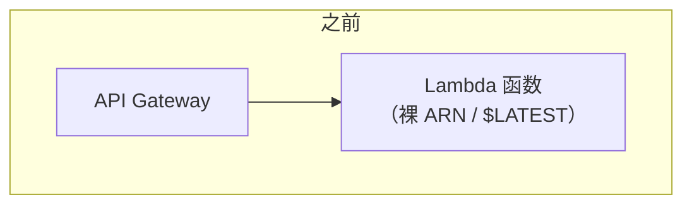
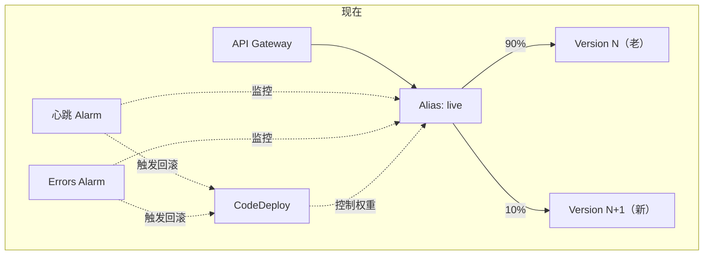
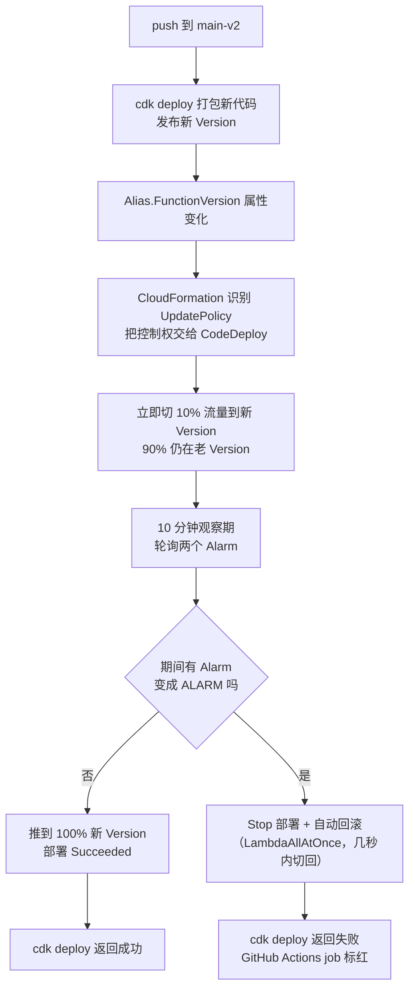

# Lambda 灰度发布架构升级 —— token-query-api

生产环境的 Lambda API 部署方式发生了一次结构性变化：从"新代码一次性全量替换旧代码"，改成"新旧版本按权重共存一段观察期，出问题自动缩回去"。这份文档记录为什么改、改了什么、以及怎么验证它确实按预期工作。这是 [gradual-rollout-canary-deployment.md](gradual-rollout-canary-deployment.md) 和 [lambda-codedeploy-canary.md](lambda-codedeploy-canary.md)（概念操练）之后，真正落地到项目 `api-stack.ts` 的记录（对应 [docs/todayToDo-0722.md](../todayToDo-0722.md) Part 2）。

- **范围**：`token-query-api`（CDK 栈）
- **日期**：2026-07-21
- **提交**：`c53580f`（灰度主体）、`c47c8fe`（补充 Errors 告警）

## 之前 vs 现在

核心变化只有一句话：**API Gateway 现在调用的不再是 Lambda 函数本身，而是一个叫 `live` 的固定别名（Alias），这个别名可以同时、按比例指向两个不同版本的代码。** 多出来的这一层间接寻址，就是灰度发布的全部地基。

| | 之前 | 现在 |
|---|---|---|
| API Gateway 调用目标 | Lambda 函数裸 ARN | `live` Alias |
| 部署行为 | 覆盖 `$LATEST`，立即 100% 生效 | 发布新 Version，Alias 加权切流（10% → 100%） |
| 新代码有 bug 的影响面 | 100% 请求瞬间受影响 | 观察期内最多 10% 请求受影响 |
| 谁来判断要不要回滚 | 人工发现、人工回滚 | 两个 CloudWatch Alarm 自动判断、自动回滚 |





概念速查表（Version/Alias/Application/Deployment Group 的关系）见 [lambda-codedeploy-canary.md](lambda-codedeploy-canary.md)，这里不重复。

## 具体实现（[api-stack.ts](../../infra/cdk/lib/api-stack.ts)）

### 把 L1 CfnFunction 包装成可以发版本的引用

项目的 VPC 子网/安全组是通过 CfnParameter 的 token 列表传进来的（synth 时长度未知），跟 CDK L2 `lambda.Function` 需要的具体 `ISubnet[]` 数组天然不兼容——所以没有整体切到 L2，而是把现有的 L1 `CfnFunction` 包一层引用，再在这层引用上建 Version/Alias：

```ts
const importedApiFunction = lambda.Function.fromFunctionAttributes(this, "ImportedTokenQueryFunction", {
  functionArn: apiFunction.attrArn,
  sameEnvironment: true,
});
const apiFunctionVersion = new lambda.Version(
  this,
  `TokenQueryFunctionVersion${codeAssetHash}`, // 构造 ID 里拼代码哈希
  { lambda: importedApiFunction },
);
const apiFunctionAlias = new lambda.Alias(this, "TokenQueryFunctionLiveAlias", {
  aliasName: "live",
  version: apiFunctionVersion,
});
```

构造 ID 里拼一段代码资产哈希（`codeAssetHash`，来自 `functionCode.s3Location.objectKey`），是为了让每次代码变化时 CloudFormation 把它当成一个全新资源来创建——旧 Version 保留不删。这正是 CDK 内置 `Function.currentVersion` 的实现原理，这里是手动复刻了一遍，因为走的是 L1 路线。

API Gateway 的 Integration 和 Lambda Permission 也都从指向 `apiFunction` 改成指向 `apiFunctionAlias`，不然流量绕过了 alias，灰度切流量就没意义了。

### 两个告警，分工不同

复用已有的心跳 Alarm（[monitoring-stack.ts](../../infra/cdk/lib/monitoring-stack.ts) 的 `token-query-api-heartbeat-failed`），同时新增一个 Lambda 原生 Errors 告警——两者互补，而不是二选一：

| | 心跳 Alarm | Errors Alarm（新增） |
|---|---|---|
| 信号来源 | Synthetics 定时探测 `/health` | Lambda 原生 Errors 指标 |
| 采样频率 | 每 5 分钟一次 | 每次真实调用都算 |
| 测的是什么 | 端到端连通性（DNS/网关/网络） | 代码本身有没有抛异常 |
| 维度范围 | 整个函数 | 只统计经过 `live` alias 的调用 |
| 缺数据时怎么判定 | `breaching`（没数据=有问题） | `notBreaching`（没流量≠有问题） |

```ts
const aliasErrorsAlarm = apiFunctionAlias
  .metricErrors({ period: Duration.minutes(1), statistic: "sum" })
  .createAlarm(this, "TokenQueryFunctionLiveAliasErrorsAlarm", {
    alarmName: "token-query-api-live-alias-errors",
    threshold: 1,
    evaluationPeriods: 1,
    comparisonOperator: cloudwatch.ComparisonOperator.GREATER_THAN_OR_EQUAL_TO_THRESHOLD,
    treatMissingData: cloudwatch.TreatMissingData.NOT_BREACHING,
  });
```

`Alias.metricErrors()` 会自动带上正确的维度（`Resource: functionName:live`），不需要手工拼 CloudWatch 维度——这是选择走 CDK 而不是手工 `put-metric-alarm` 的直接好处。为什么不干脆只用这一个更精确的 Alarm、把心跳 Alarm 换掉：心跳测的是"端到端连通性"（DNS/API Gateway/网络层），Errors 测的是"代码本身有没有抛异常"，两者覆盖的失败模式不同，留着都要比只留一个更安全。

### Deployment Group：策略 + 双告警 + 自动回滚

```ts
new codedeploy.LambdaDeploymentGroup(this, "TokenQueryDeploymentGroup", {
  application: new codedeploy.LambdaApplication(this, "TokenQueryCodeDeployApplication", {
    applicationName: "token-query-api",
  }),
  deploymentGroupName: "token-query-api-dg",
  alias: apiFunctionAlias,
  deploymentConfig: codedeploy.LambdaDeploymentConfig.CANARY_10PERCENT_10MINUTES,
  alarms: [heartbeatAlarm, aliasErrorsAlarm],
  autoRollback: {
    deploymentInAlarm: true,
    failedDeployment: true,
    stoppedDeployment: true,
  },
});
```

观察期用了 10 分钟而不是更常见的 5 分钟——因为心跳 canary 本身 5 分钟才跑一次，5 分钟的观察窗口有可能一次探测都赶不上。CodeDeploy 需要的 IAM Service Role 也没有手动建，`LambdaDeploymentGroup` 不传 `role` 时会自动生成一个绑定 `AWSCodeDeployRoleForLambdaLimited` 的角色。

## 一次部署实际发生了什么

没有新增任何一行 GitHub Actions 脚本——`deploy-lambda.yml` 里原本那条 `cdk deploy` 命令，行为被 CloudFormation 自己升级了。关键在于生成的 Alias 资源上带了一段原生的 `UpdatePolicy: CodeDeployLambdaAliasUpdate`（`cdk synth` 直接可见）：只要这次更新让 Alias 的 `FunctionVersion` 属性发生变化，CloudFormation 就会把控制权交给 CodeDeploy。



代价：真正有代码变更的部署会比以前多花 10 分钟以上（CloudFormation 在等观察期跑完），这是预期行为，不是 CI 卡住。

## 刻意没动的地方

| 决策 | 理由 |
|---|---|
| preview 环境（`preview-api-stack.ts`）不做灰度 | PR 一关就整个销毁，生命周期太短，灰度没有意义 |
| `deploy-lambda.yml` 一行没改 | CloudFormation 原生 `UpdatePolicy` 已经接管，多写脚本反而是重复劳动 |
| 没把 `CfnFunction`（L1）整体切到 L2 | VPC 子网走的是 SSM 参数 token 列表，跟 L2 需要的具体子网对象数组不兼容 |
| 没有替换心跳 Alarm，而是两个并存 | 心跳测的是"端到端连通性"，Errors 测的是"代码本身"，两者互补而非重复 |

## 已经跑过的验证

下面这些都是实际执行过的命令和结果，不是纸面推演：

```bash
cdk diff token-query-api          # 纯增量变更，无资源被销毁，Permission 替换但同一次更新内完成
aws lambda get-alias --name live   # FunctionVersion: "1"，alias 正确创建
aws deploy get-deployment-group    # AlarmConfiguration.enabled: true（默认就对，不用像 Part 1 那样手动扳开关）
aws lambda invoke ...:live         # 200 OK，alias 可正常调用
# gh run watch 29860236485        # Deploy Lambda workflow 成功，1m42s（首次切 alias，无灰度可比对）
# gh run watch 29861340423        # 追加 Errors alarm 后再次部署，1m32s，list-deployments 为空
                                   # （证明这次纯 CDK 改动没有触发任何 CodeDeploy 部署，符合预期）
```

还没做、需要下次真实代码变更时才能验证的：观察一次带着实际流量切换的 canary 过程（`RoutingConfig` 短暂出现两个 Version 的加权），以及一次真实的自动回滚（目前只在 Part 1 的练习函数上验证过回滚机制本身有效）。

## 常见疑问

- **部署会不会导致线上无法访问？** 不会——Lambda 没有"停旧进程再起新进程"这个环节，部署本质是元数据更新（哪个 alias 指向哪个 version），老版本全程持续在线服务，不存在空窗期。真正对应的现象是冷启动（流量第一次分配到全新 Version 时，如果没有热的执行环境需要临时拉起），但那只影响撞上冷启动的个别请求延迟，不是整体不可用。
- **心跳检测会不会因为灰度切流而失效？** 不会，反而是这套机制故意让它生效——灰度期间心跳的探测请求也有对应权重的概率落在新版本上，新版本真坏了就应该报失败，这是设计好要发生的事，不是 bug。
