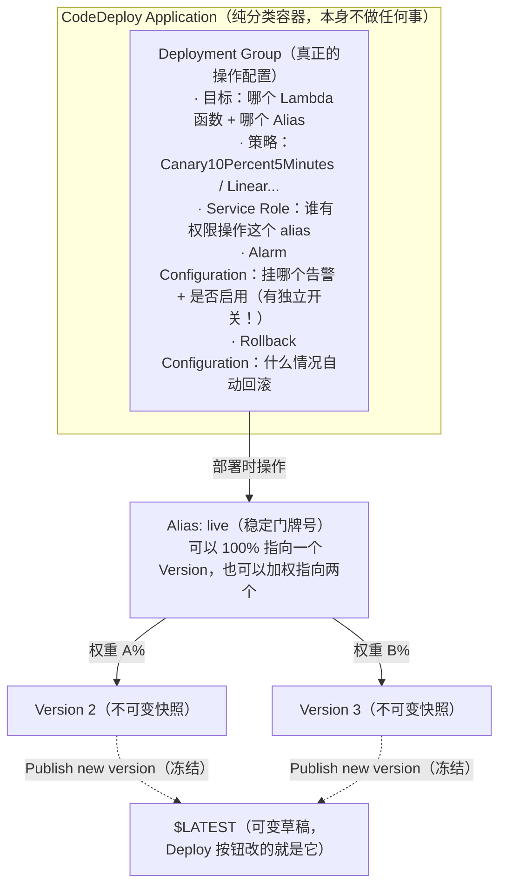
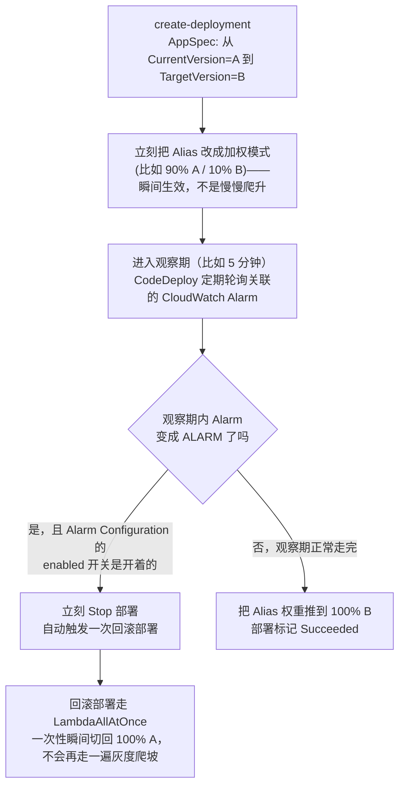

# Lambda 灰度发布（CodeDeploy Canary）概念详解

这份文档是对 [gradual-rollout-canary-deployment.md](gradual-rollout-canary-deployment.md) 里 Lambda 那部分的概念深挖，来自一次动手操练（[docs/todayToDo-0722.md](../todayToDo-0722.md) Part 1）之后的复盘——操练本身跑通了灰度切流量和自动回滚，但过程中好几个概念容易搅在一起，这里专门理清楚。

## 核心主线：草稿 → 快照 → 门牌号

Lambda 灰度发布的地基是三个东西的关系，搞懂这条主线，后面 CodeDeploy 的一堆配置就都好理解了：

- **`$LATEST`（草稿）**：可变、随时会被覆盖。点 **Deploy** 改的就是它。
- **Version（快照）**：点 **Publish new version** 的那一刻，把 `$LATEST` 当时的内容原样冻结成一个编号（1、2、3...），**发布后永远不会再变**。灰度发布必须建立在"两个都不会变"的东西之间切流量，所以不能直接对 `$LATEST` 做灰度。
- **Alias（门牌号）**：一个固定的名字（比如 `live`），外部所有调用方永远只认这个名字，不认 Version 号。Alias 背后可以指向一个 Version，也可以**按权重同时指向两个 Version**——这就是灰度分流的实现方式。

一句话类比：**Version 像 Git 的 commit（不可变快照），Alias 像 Git 的分支指针 `main`（可移动，别人只认分支名不认 commit hash）**。

## 层次结构图

一个 Application 下面可以建**多个** Deployment Group（比如同一个项目里好几个 Lambda 函数都要灰度，各自配置独立、互不影响）。所以：**Application = 这属于哪个项目（纯分类）**，**Deployment Group = 具体怎么部署这一个东西（真正干活的地方）**。

## 一次部署背后的状态机

### 几个动手验证过的关键事实

- **Alarm Configuration 有两层，容易漏掉第二层**：(1) 把 alarm 加进 rollback 触发列表；(2) 还有一个**独立的 `enabled` 总开关**——不开的话，alarm 就算真的变成 ALARM，CodeDeploy 也完全不检测，部署没有任何反应。这是我们操练时踩的坑，详见 `docs/todayToDo-0722.md`。
- **CodeDeploy 检测 Alarm 状态变化不是瞬时的**，有几十秒到一分钟的轮询延迟，手动 `set-alarm-state` 之后要耐心等一下再看部署状态。
- **回滚部署本身走的是 `LambdaAllAtOnce`**，不是原来配的 Canary 策略——这个从回滚部署详情页的 "Deployment configuration" 字段能直接看到。逻辑上说得通：回滚要的是"立刻恢复"，不应该再慢慢爬坡。
- **控制台看不到"回滚到底切到了哪个 Version 号"**——Lambda 类型的部署在控制台里没有 EC2/ECS 那种 "Target details" 标签页，只能看到 "Original 0% → Replacement 100%" 这种百分比展示，不显示具体版本号。CLI 的 `get-deployment-target` 虽然能查到 `currentVersion`/`targetVersion` 字段，但这两个字段容易理解反（它记录的是"这次部署对应的原始转换关系"，不是"最终停在哪"）。**唯一权威的答案永远是直接查 Lambda 的 Alias**（`aws lambda get-alias` 或者 Lambda 控制台的 Aliases 标签页）。

## 落地到 CDK 之后：触发方式变了（[api-stack.ts](../../infra/cdk/lib/api-stack.ts)）

Part 1 手动操练时，是自己拼一个 AppSpec 再调 `aws deploy create-deployment` 来触发一次灰度部署——这是"我主动告诉 CodeDeploy 要切一次"。

落地到 CDK 之后用的是另一条路：CloudFormation 原生支持在 `AWS::Lambda::Alias` 资源上挂一个 `UpdatePolicy: CodeDeployLambdaAliasUpdate`（`cdk synth` 能直接看到这段），效果是——**只要这次 `cdk deploy` 让 Alias 的 `FunctionVersion` 属性发生了变化，CloudFormation 自己就会把这次更新转交给 CodeDeploy 去跑灰度**，不需要额外调用任何 CodeDeploy API。`deploy-lambda.yml` 里原本那句 `cdk deploy` 完全不用改，行为自动升级成"发布新 Version → 灰度切流量 → 观察 Alarm → 成功或自动回滚"这一整套。

代价是这次 `cdk deploy` 会等得比以前久（Canary10Percent10Minutes 配置下，观察期就要 10 分钟+），这是预期行为，不是 CI 卡住。

## 常见问题自查

- Deploy 按钮 vs Publish new version：一个改草稿，一个把草稿冻结成快照，别搞反
- 为什么不能直接对 `$LATEST` 做灰度：因为它随时会被覆盖，灰度切流量的两端必须是稳定不变的 Version
- Application 和 Deployment Group 谁才是"真正配置的地方"：Deployment Group，Application 只是分类容器
- Service Role 报 "Cross-account pass role is not allowed" 大概率是什么：不是真的跨账号，通常是 ARN 输入有误、或者角色刚创建还没传播完成，建议用搜索框选而不是手动粘贴 ARN
