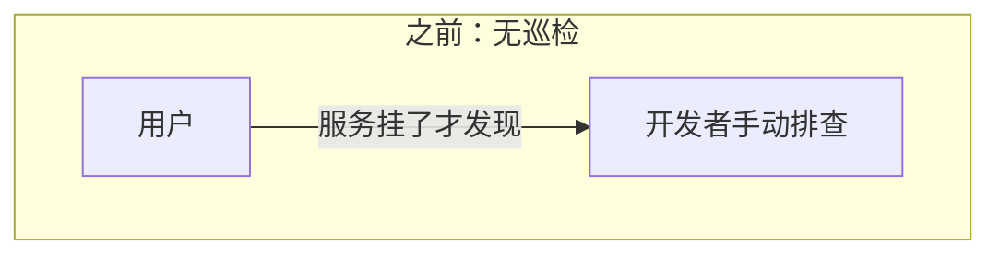
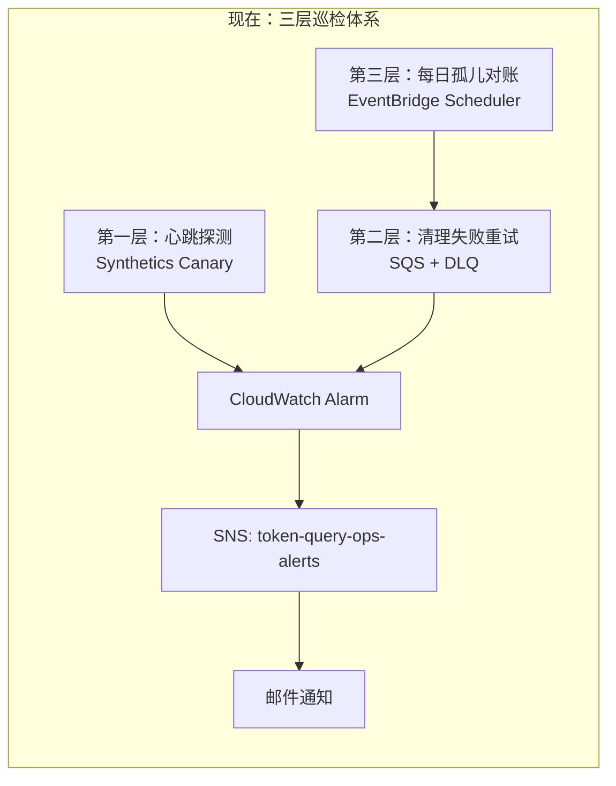
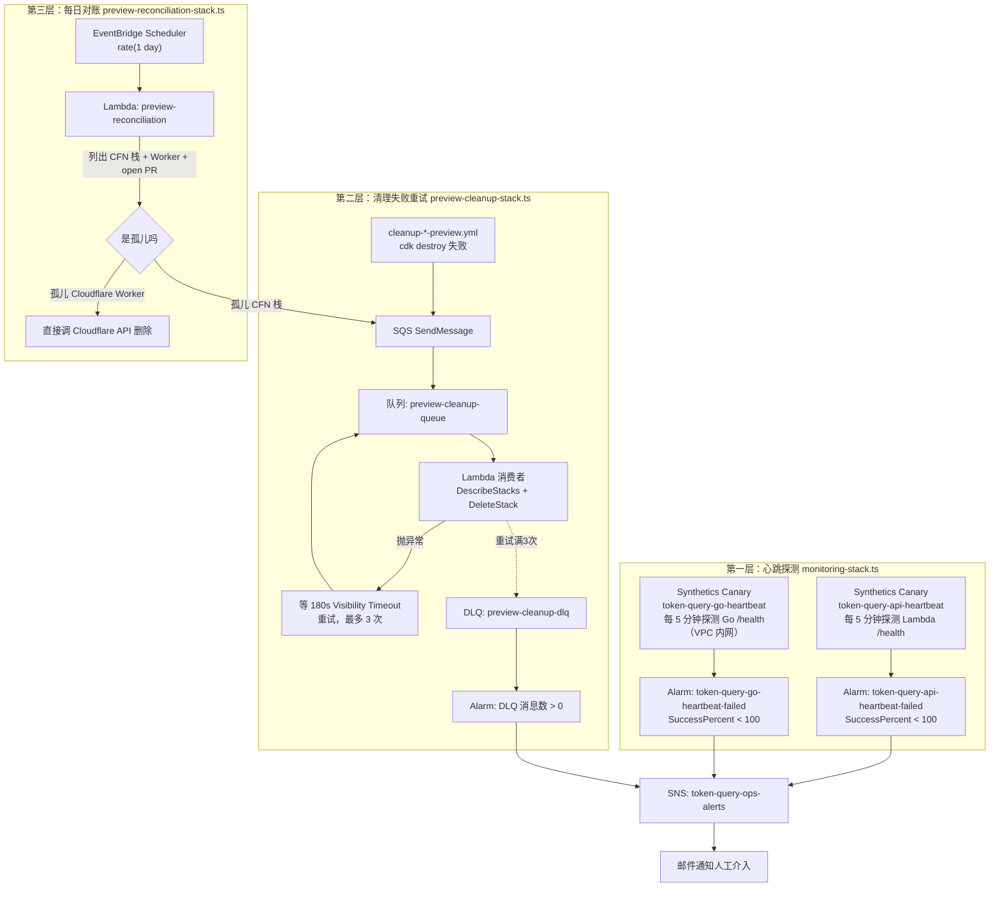
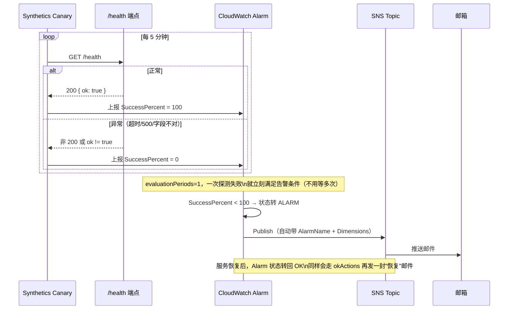
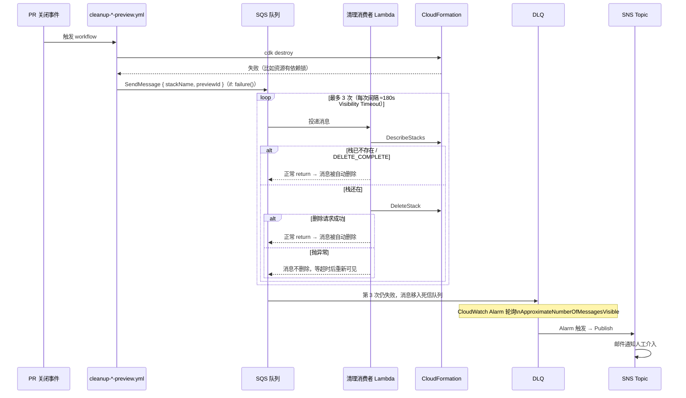
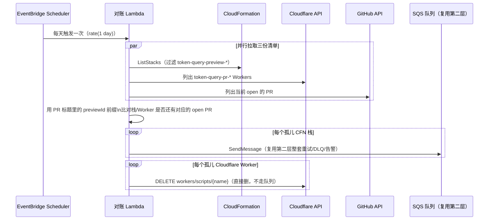

# 巡检 / 可观测性架构升级 —— token-query 运维监控体系

这份文档梳理 token-query 项目从"没有任何自动巡检"到"心跳探测 + 告警通知 + 失败自动重试 + 每日孤儿资源对账"这一整套运维体系的建设过程，把分散在 [preview-cleanup-flow.md](preview-cleanup-flow.md)、[sns-sqs-dlq.md](sns-sqs-dlq.md)、[eventbridge.md](eventbridge.md)、`docs/todayToDo.md` 里的巡检相关内容合并成一份架构视角的文档，并补充之前欠缺的时序图。概念性的 AWS 知识（SNS/SQS/DLQ 是什么、EventBridge 三兄弟怎么分）不在这里重复，只讲"巡检体系本身怎么搭起来的、各部分怎么串联"。

- **范围**：`token-query-monitoring`、`token-query-preview-cleanup`、`token-query-preview-reconciliation` 三个 CDK 栈
- **对应记录**：`docs/todayToDo.md` Part 1/2（Synthetics 巡检）、Part 3/4（SNS/SQS 练习 + 落地）、Part 6（清理失败重试）、Part 7（每日对账）

## 之前 vs 现在

| | 之前 | 现在 |
|---|---|---|
| 服务健康探测 | 无——只能等用户反馈或人工手动 curl | 两个 Synthetics 心跳 canary，每 5 分钟自动探测一次 |
| 探测失败之后谁知道 | 没人知道 | CloudWatch Alarm 自动判定 → SNS 统一告警 Topic → 邮件通知 |
| PR 关闭时资源清理失败 | 静默失败，资源永久残留，没人发现 | 自动进 SQS 重试（180s 间隔 × 3 次）→ 还失败就进 DLQ → 告警 |
| "根本没走清理流程"的资源（如手动 `workflow_dispatch` 部署的 preview） | 完全没有兜底，只能靠人工偶尔翻账单发现 | 每天定时对账 Lambda 扫描孤儿栈/Worker，自动清理或转入重试队列 |
| 告警通知渠道 | 无 | 统一的 `token-query-ops-alerts` SNS Topic，后续任何新告警都直接挂这里，不用每次新建 |

## 三层巡检体系的定位

不是三个独立功能的堆砌，而是分层兜底，每一层解决上一层解决不了的问题：

1. **第一层——心跳探测（谁在正常运行？）**：Synthetics Canary 定时探测 `/health`，判断服务本身是不是活的。这是最基础的一层，回答"现在服务健不健康"。
2. **第二层——清理失败重试（一次性操作失败了怎么办？）**：PR 关闭触发的 `cdk destroy` 是一次性操作，失败了不会自己重试，所以需要 SQS + DLQ 兜底重试三次，实在不行才报警找人。
3. **第三层——每日对账（连尝试清理的机会都没有的资源怎么办？）**：第二层的前提是"清理流程真的跑起来了"，但如果压根没触发清理（手动部署的 preview、workflow 被取消），第二层无从介入。第三层用每日定时扫描的方式独立地发现这类"漏网之鱼"，发现后复用第二层的重试机制处理。

三层共用同一个通知出口（`token-query-ops-alerts` SNS Topic），这样以后不管加多少种新告警，人只需要盯一个邮箱。

## 整体架构图

## 时序图：心跳探测 → 告警 → 通知

## 时序图：Preview 清理失败 → 重试 → 死信 → 告警

## 时序图：每日孤儿资源对账

## 三层各自的关键设计取舍

### 第一层：为什么两个 canary 是独立的，不是一个

Lambda 和 Go 各自一个 canary、各自一个 Alarm，而不是"一个 canary 顺便探两个服务"。原因：如果合并成一个，Go 挂了会导致 Lambda 的 canary 也报失败，收到告警时无法从"哪个 Alarm 触发了"直接判断是哪个服务出问题，还得去翻日志——拆开之后，Alarm 名字本身就是诊断信息的一部分（[monitoring-stack.ts](../../infra/cdk/lib/monitoring-stack.ts) 里专门有注释记录了这个设计意图）。

### 第一层：`SuccessPercent` 而不是 `Failed`（真实踩过的坑）

初版用 `metricName: "Failed"` + `treatMissingData: breaching`，结果 canary 全部通过但 Alarm 一直是 ALARM 状态——因为 `Failed` 这个指标只在失败时才有数据点，"没数据"（正常情况）被误判成"breaching"。改成 `SuccessPercent`（每次探测无论成败都会上报）之后问题消失。这个坑和第二层 DLQ Alarm 的 `treatMissingData: notBreaching` 刚好是相反的方向，具体原因见下表。

| Alarm | 用的指标 | `treatMissingData` | 为什么这么设 |
|---|---|---|---|
| 心跳 Alarm | `SuccessPercent` | `breaching` | 这个指标每次探测都会上报一个值，"没数据"本身就不正常（说明 canary 没在跑），应该按有问题处理 |
| DLQ Alarm | `ApproximateNumberOfMessagesVisible` | `notBreaching` | DLQ 长期是空的、没有消息是正常状态，"没数据"不代表出了问题 |

### 第二层：为什么是"重试 + DLQ"而不是"失败就立刻告警"

`cdk destroy` 失败的原因大概率是瞬时性的（依赖资源还没释放完、API 限流等），第一次失败就直接打扰人工不划算。SQS 的 Visibility Timeout + `maxReceiveCount` 机制天然提供了"自动重试几次，实在不行再叫人"的能力，不用自己写重试循环代码。

### 第三层：为什么孤儿栈复用第二层的队列，孤儿 Worker 不复用

第二层的消费者 Lambda 只认识"删 CloudFormation 栈"这一种操作（`DescribeStacks` + `DeleteStack`），消息格式是 `{ stackName, previewId }`。孤儿 Worker 的清理动作（调 Cloudflare API）跟这个完全不是一回事，硬塞进同一个消息格式和消费者里反而增加耦合，所以对账 Lambda 直接调用 Cloudflare API，不经过队列。这也是 [sns-sqs-dlq.md](sns-sqs-dlq.md) 里"拆队列拆的是消费者能力边界，不是消息标签"这条原则的一个实际应用。

## 涉及的资源一览

| 层 | 资源 | 名称 | 定义位置 |
|---|---|---|---|
| 第一层 | Synthetics Canary ×2 | `token-query-api-heartbeat` / `token-query-go-heartbeat` | `monitoring-stack.ts` |
| 第一层 | CloudWatch Alarm ×2 | `token-query-api-heartbeat-failed` / `token-query-go-heartbeat-failed` | `monitoring-stack.ts` |
| 全局 | SNS Topic（三层共用） | `token-query-ops-alerts` | `monitoring-stack.ts`，跨栈引用走 SSM `/token-query/monitoring/ops-alerts-topic-arn` |
| 第二层 | SQS 队列 / DLQ | `token-query-preview-cleanup-queue` / `-dlq` | `preview-cleanup-stack.ts` |
| 第二层 | Lambda 消费者 | `token-query-preview-cleanup-consumer` | `preview-cleanup-stack.ts` |
| 第二层 | CloudWatch Alarm | `token-query-preview-cleanup-dlq-not-empty` | `preview-cleanup-stack.ts` |
| 第三层 | Lambda | `token-query-preview-reconciliation` | `preview-reconciliation-stack.ts` |
| 第三层 | EventBridge Schedule | `token-query-preview-reconciliation-daily`，`rate(1 day)` | `preview-reconciliation-stack.ts` |
| 第三层 | Secrets（手动创建） | `token-query/reconciliation/github-token`、`.../cloudflare-api-token` | 部署前手动 `aws secretsmanager create-secret` |

## 详细内容去哪找

这份文档只讲架构和串联关系，具体的代码逐行讲解、部署验证命令、AWS 概念科普放在各自的详细文档里，避免重复：

- 心跳探测 + Alarm 指标选型的完整背景 → `docs/todayToDo.md` Part 1/2
- SQS/DLQ/SNS 的通用概念、拆队列判断标准 → [sns-sqs-dlq.md](sns-sqs-dlq.md)
- EventBridge Rules/Scheduler/Pipes 的区别、失败重试机制 → [eventbridge.md](eventbridge.md)
- 第二层 + 第三层的完整分段讲解、验证命令、部署状态 → [preview-cleanup-flow.md](preview-cleanup-flow.md)
- 部署/清理命令 → `docs/cdk-deploy-commands.md`

## 还没做完的部分

跟 [preview-cleanup-flow.md](preview-cleanup-flow.md) 里记录的一致，这里不重复维护两份进度：

- 清理失败重试的完整验证（测试 A/B、DLQ 告警邮件确认）
- 每日对账 Lambda 的一次真实触发验证（手动 `aws lambda invoke`，确认孤儿资源被正确识别）
