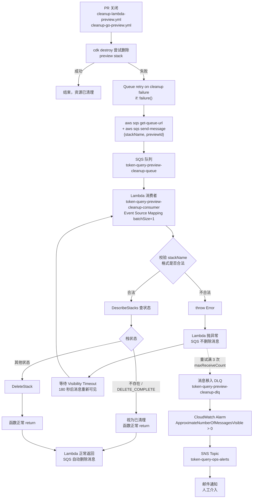
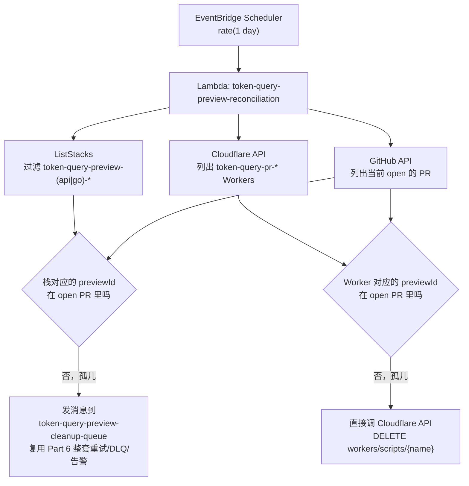

# PR Preview 清理失败兜底 — 完整流程图

对应 [docs/todayToDo.md](../todayToDo.md) Part 6，代码在 `infra/cdk/lib/preview-cleanup-stack.ts`。这份文档记录整条链路怎么走，方便以后 review 或者排查问题时不用重新读一遍代码。

> **状态**：三个栈（`token-query-monitoring` 的 SSM 导出、`token-query-permissions` 的新权限、全新的 `token-query-preview-cleanup`）已经 `cdk deploy` 完成（2026-07-20）。验证测试 A 进行中，测试 B / 告警确认 / 补充部署文档还没做，进度见文末「验证流程」。

## 整体流程图



## 分段讲解

### 1. 触发源：两个 cleanup workflow 的失败分支

- `cleanup-lambda-preview.yml` / `cleanup-go-preview.yml` 里的 `cdk destroy` 步骤本身不变，是"第一次尝试"
- 新增的 `Queue retry on cleanup failure` 步骤只在 `if: failure()` 时跑：先 `aws sqs get-queue-url` 拿队列地址（不硬编码 account id），再 `aws sqs send-message` 把 `{ stackName, previewId }` 的 JSON 发过去
- 这一步需要的 IAM 权限（`sqs:GetQueueUrl` / `sqs:SendMessage`，限定在这一个队列 ARN）已经加到 `permissions-stack.ts` 的部署角色上（`QueuePreviewCleanupRetries`）

### 2. SQS 队列：`token-query-preview-cleanup-queue`

- Visibility Timeout 180 秒 = 消费者 Lambda 超时（30 秒）的 6 倍，按 SQS 官方建议设置，避免消息还没处理完就被第二次投递
- Redrive Policy：`maxReceiveCount: 3`，超过 3 次还没被成功处理（没有正常 return）就转入 DLQ

### 3. Lambda 消费者：`token-query-preview-cleanup-consumer`

- Event Source Mapping `batchSize: 1`：每条消息独立一次调用，成败互不影响，不用处理批量失败上报（`reportBatchItemFailures`）这层复杂度
- 处理逻辑（inline Node.js，用运行时自带的 AWS SDK v3，不需要额外打包）：
  1. `JSON.parse` 消息体，解析失败 → `throw`
  2. 用正则 `^token-query-preview-(api|go)-[a-z0-9-]+$` 校验 `stackName` 格式，不合法 → `throw`
  3. `DescribeStacks` 查当前栈状态：查不到（栈已经被删完）或者状态是 `DELETE_COMPLETE` → 视为已清理，函数正常 `return`
  4. 其他状态 → 调 `DeleteStack`，然后正常 `return`
- **IAM 权限**限定在 `token-query-preview-api-*` / `token-query-preview-go-*` 这两类栈的 ARN，不是通配所有 CloudFormation 栈

### 4. 成功 / 失败的判定，完全由"函数是否抛异常"决定

这是 SQS + Lambda Event Source Mapping 的核心机制，不是我们代码里手写的判断：

- 函数正常 `return`（没有 `throw`）→ AWS Lambda 服务自动帮这一批消息调 `DeleteMessage`，我们的代码不用管
- 函数抛出异常 → 消息**不会**被删除，留在队列里，等 Visibility Timeout（180 秒）过期后重新可见，被下一次轮询取到再试一次

详见对话记录 / [sns-sqs-dlq.md](sns-sqs-dlq.md) 里关于 Visibility Timeout 的说明，同一套机制。

### 5. 死信与告警

- 重试满 3 次（`maxReceiveCount: 3`）还是抛异常 → SQS 自动把消息**移动**（不是复制）到 DLQ `token-query-preview-cleanup-dlq`
- DLQ 上配了一个 CloudWatch Alarm：`ApproximateNumberOfMessagesVisible > 0` 就触发，`treatMissingData: notBreaching`（DLQ 长期为空是正常状态，没数据不代表异常，这一点跟 Part 2 canary 那次 `SuccessPercent` alarm 的坑刚好方向相反，别抄反了）
- Alarm 触发后走 Part 4 建好的共用 SNS Topic `token-query-ops-alerts`，通知到已订阅确认的邮箱，不用另建通知渠道

## 涉及的资源一览

| 资源 | 名称 | 定义位置 |
|---|---|---|
| SQS 队列 | `token-query-preview-cleanup-queue` | `preview-cleanup-stack.ts` |
| DLQ | `token-query-preview-cleanup-dlq` | `preview-cleanup-stack.ts` |
| Lambda 消费者 | `token-query-preview-cleanup-consumer` | `preview-cleanup-stack.ts` |
| CloudWatch Alarm | `token-query-preview-cleanup-dlq-not-empty` | `preview-cleanup-stack.ts` |
| SNS Topic（复用） | `token-query-ops-alerts` | `monitoring-stack.ts`，跨栈引用走 SSM 参数 `/token-query/monitoring/ops-alerts-topic-arn` |
| CDK Stack | `token-query-preview-cleanup` | `bin/token-query.ts`，`CDK_STACK_SCOPE=preview-cleanup` |

## 第二层兜底：定时对账（Preview Reconciliation）

对应 Part 7 第二层。上面这一整套（触发→队列→消费者→死信→告警）解决的是"cleanup workflow 跑了但失败了"，但堵不住另一种情况：**cleanup workflow 压根没跑**——比如通过 `workflow_dispatch` 手动部署的 preview（没有对应的 PR 事件可以挂 cleanup 钩子），或者 cleanup workflow 本身被取消/GitHub Actions 故障导致没执行。这层是独立的定时兜底，跟前面的重试机制平级，不是它的下游。

### 设计



- **孤儿 CFN 栈**：丢进 Part 6 已有的 SQS 队列，复用同一套重试/DLQ/Alarm，不用另起一套失败处理逻辑
- **孤儿 Cloudflare Worker**：Part 6 的消费者 Lambda 只会调 `DeleteStack`，不认识"删 Worker"这件事，所以对账 Lambda 直接调 Cloudflare API 删除，不硬塞进 SQS 消息格式里
- previewId 的"是否还活着"判断依据是 **GitHub 上 PR 的标题**（`^(bug|feat|fix|chore|hotfix)-\d+:` 这个前缀），跟 `cleanup-lambda-preview.yml` 等 workflow 解析 preview id 的正则是同一套规则

### 涉及的资源

| 资源 | 名称 | 定义位置 |
|---|---|---|
| Lambda | `token-query-preview-reconciliation` | `preview-reconciliation-stack.ts`，代码在 `infra/cdk/lambda/preview-reconciliation/index.js` |
| EventBridge Schedule | `token-query-preview-reconciliation-daily` | 同上，`rate(1 day)` |
| Secrets（手动创建，不由 CDK 管理） | `token-query/reconciliation/github-token`、`token-query/reconciliation/cloudflare-api-token` | 部署前必须先手动 `aws secretsmanager create-secret`，见 [cdk-deploy-commands.md](../cdk-deploy-commands.md) |
| CDK Stack | `token-query-preview-reconciliation` | `bin/token-query.ts`，`CDK_STACK_SCOPE=preview-reconciliation`，依赖 `token-query-preview-cleanup` 导出的 SSM 参数 |

### 部署 + 验证（还没做，交给你自己走）

1. 手动创建两个 Secret（GitHub PAT 只需要读 PR 的权限；Cloudflare token 需要 Workers Scripts 的 Read + Edit，Edit 是为了能删孤儿 Worker）
2. `cdk deploy token-query-preview-reconciliation --parameters CloudflareAccountId=<你的账号id>`
3. 手动 `aws lambda invoke` 触发一次，不用等第二天的定时调度
4. 看 CloudWatch Logs 确认扫描到的栈/Worker/open PR 数量，以及有没有孤儿资源被处理
5. 想验证"真的能发现孤儿"，可以参考 Part 7 checklist 里的思路：手动 `workflow_dispatch` 部署一个 Worker preview（用一个确定不存在 open PR 的 previewId），然后手动触发一次这个 Lambda，确认它被识别成孤儿并删除

具体命令见 [cdk-deploy-commands.md](../cdk-deploy-commands.md) 里「Preview 环境定时对账层（第二层兜底）生产部署」这一节。

## 验证流程

不用真的等 `cdk destroy` 自然失败，也不要去手动破坏真实 preview 资源——用手动发消息模拟失败，完整走一遍重试 → 死信 → 告警链路。

### 0. 先 export 变量（每个新终端会话都要重新执行一遍）

下面所有命令都直接引用这几个变量，没跑这一步会全部失败/打到空 URL：

```bash
export QUEUE_URL=https://sqs.us-west-2.amazonaws.com/707605822527/token-query-preview-cleanup-queue
export DLQ_URL=https://sqs.us-west-2.amazonaws.com/707605822527/token-query-preview-cleanup-dlq
export LAMBDA_NAME=token-query-preview-cleanup-consumer
export ALARM_NAME=token-query-preview-cleanup-dlq-not-empty
export REGION=us-west-2
```

### 1. 测试 A（推荐，完全不碰真实资源）—— 进行中

发一条 `stackName` 格式不对的消息，让消费者的输入校验直接 `throw`，观察它按 Visibility Timeout 节奏重试、最终落进 DLQ：

```bash
aws sqs send-message --queue-url $QUEUE_URL \
  --message-body '{"stackName": "not-a-valid-stack-name"}' \
  --region $REGION
```

因为 `maxReceiveCount: 3` + Visibility Timeout 180 秒，完整走完大概需要 **9-10 分钟**（3 轮 × 180 秒 + 一点调度延迟）。查进度：

```bash
# 看主队列 / DLQ 各有多少条消息（这几个值有约 1 分钟的统计延迟，不是实时的）
aws sqs get-queue-attributes --queue-url $QUEUE_URL \
  --attribute-names ApproximateNumberOfMessages ApproximateNumberOfMessagesNotVisible \
  --region $REGION

aws sqs get-queue-attributes --queue-url $DLQ_URL \
  --attribute-names ApproximateNumberOfMessages \
  --region $REGION

# 更准的办法：直接看 Lambda 有没有被多次调用（每次重试都是一次新的调用）
aws logs describe-log-streams --log-group-name /aws/lambda/$LAMBDA_NAME \
  --order-by LastEventTime --descending --max-items 5 --region $REGION \
  --query 'logStreams[*].{stream:logStreamName,last:lastEventTimestamp}' --output table

# 看某一次调用具体打了什么日志（把 stream 名换成上面查到的）
aws logs get-log-events --log-group-name /aws/lambda/$LAMBDA_NAME \
  --log-stream-name '<上面查到的 stream 名>' --region $REGION \
  --query 'events[*].message' --output text
```

**判断标准**：DLQ 的 `ApproximateNumberOfMessages` 变成 `1` 就算成功。控制台看的话，去 [SQS 控制台](https://console.aws.amazon.com/sqs) → `token-query-preview-cleanup-dlq` → 详情页确认 Messages available，或者直接点 **Send and receive messages → Poll for messages** 能实际看到这条消息内容。

**关键提醒（Lambda 抛错后消息是否立刻可见）**：不会立刻可见。Visibility Timeout 是从消息被 `ReceiveMessage` 取走那一刻开始计时的，跟处理花了多久无关——哪怕 Lambda 几十毫秒就抛了异常，消息也必须等完整的 180 秒才会重新可见，除非消费者代码主动调 `ChangeMessageVisibility` 把超时改短（我们的消费者代码没有做这个，没必要为了这个清理任务额外加复杂度）。

### 2. 测试 B（可选，更贴近真实失败）

找一个已经用不上的测试 preview stack，临时开 Termination Protection，让 `DeleteStack` 确定性失败：

```bash
# 打开保护（换成你要测试的、确实不要了的 preview stack 名字）
aws cloudformation update-termination-protection \
  --stack-name token-query-preview-api-<某个测试用的preview-id> \
  --enable-termination-protection \
  --region $REGION

# 发一条指向它的消息
aws sqs send-message --queue-url $QUEUE_URL \
  --message-body '{"stackName": "token-query-preview-api-<同上>", "previewId": "<同上>"}' \
  --region $REGION

# 验证完，记得关掉保护，不然这个栈以后正常删除也会失败
aws cloudformation update-termination-protection \
  --stack-name token-query-preview-api-<同上> \
  --no-enable-termination-protection \
  --region $REGION
```

### 3. 确认 DLQ 告警 + 邮件通知（依赖测试 A 或 B 先跑出真实死信）

```bash
# 查 Alarm 当前状态，进 DLQ 后下一个 5 分钟评估周期内应该变成 ALARM
aws cloudwatch describe-alarms --alarm-names $ALARM_NAME --region $REGION \
  --query 'MetricAlarms[0].{State:StateValue,Reason:StateReason}'
```

控制台确认：[CloudWatch Alarms](https://us-west-2.console.aws.amazon.com/cloudwatch/home?region=us-west-2#alarmsV2:) 搜 `token-query-preview-cleanup-dlq-not-empty`，状态变红 = ALARM；同时去邮箱确认收到通知邮件（标题会是 `ALARM: "token-query-preview-cleanup-dlq-not-empty" in ...`）。

### 4. 清理测试数据

DLQ 里躺着的测试消息不会自动消失，验证完记得手动清一下，别让 Alarm 一直亮着：

```bash
aws sqs purge-queue --queue-url $DLQ_URL --region $REGION
```

## 还没做完的部分

- [ ] 验证测试 A 走完整个重试周期，确认最终真的进了 DLQ（已发出测试消息，等待中）
- [ ] 验证测试 B（可选）
- [ ] 确认 DLQ 有消息时 Alarm 真的触发、邮箱真的收到通知
- [ ] 清理验证测试产生的 DLQ 消息（`purge-queue`）
- [ ] 更新 `docs/cdk-deploy-commands.md` 补充这部分的部署/清理命令
