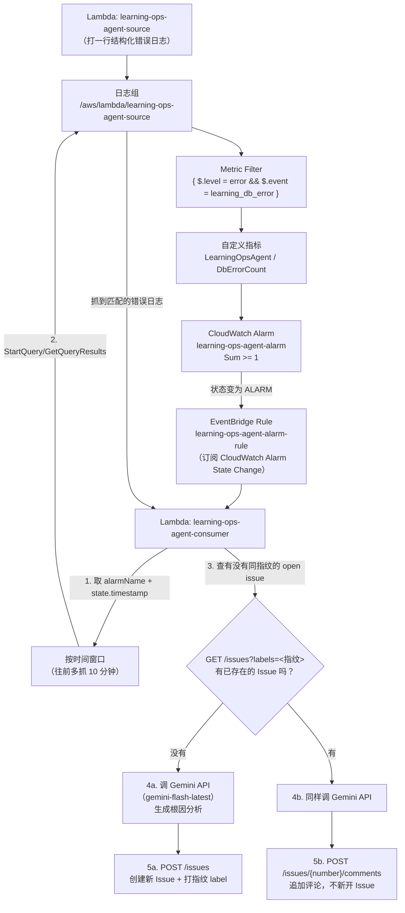

# Today's TODO — AI Ops Agent（根因定位 MVP：数据库错误自动开 Issue）

目标：验证并落地 AI Ops Agent 的第一个能力——**根因定位 + 自动生成工单**，具体场景是文档 [monitoring-architecture-upgrade.md](knowledge/monitoring-architecture-upgrade.md) 讨论过的"业务逻辑里数据库查询报错（比如没初始化导致插入失败）"。链路是：**业务代码结构化打日志 → CloudWatch Logs Metric Filter 转指标 → CloudWatch Alarm → EventBridge Rule（事件驱动，跟 Part 7 用的 Scheduler 不是一回事）→ ops-agent Lambda（查日志上下文 + 去重 + LLM 生成根因分析）→ GitHub Issue**。跟 SNS/SQS/EventBridge/Lambda 灰度那几次一样，**先用业务无关的资源练一遍这几个没碰过的机制**（Metric Filter、Alarm 触发的 EventBridge Rule、LLM 调用、GitHub Issue 创建/去重），再落地到项目真实代码。

其余四个能力（异常分析、性能优化建议、安全风险识别，以及"根因定位"里其他非数据库场景）**明确不在这次范围内**，见文末「范围说明」。

## 背景：这一步不需要新增任何应用层日志代码

先确认一个关键事实——**`apps/server` 现在已经把这个场景需要的结构化日志打好了，不用新写**：

- [github-profile.ts](../apps/server/src/services/github-profile.ts) 里 `queryAndSaveGithubProfile` 的 DB upsert 失败会抛 `GithubProfileError`，`code` 字段固定是 `"database_upsert_failed"`，`meta` 里带 `cause`/`message`
- [routes/github.ts:56](../apps/server/src/routes/github.ts#L56) 捕获后调用 `logError("github_profile_request_failed", { requestId, appEnv, previewId, code: error.code, meta: error.meta })`
- `logError`（[request-log.ts:24](../apps/server/src/utils/request-log.ts#L24)）本质是 `console.error(JSON.stringify({ level: "error", event, ...fields }))`，Lambda 运行时会把 stdout/stderr 原样收进 CloudWatch Logs，已经是可以直接被 Metric Filter 匹配的 JSON 格式

也就是说，Metric Filter 直接可以匹配 `{ $.level = "error" && $.event = "github_profile_request_failed" && $.code = "database_upsert_failed" }`，第一版落地**完全不用改 `apps/server` 的代码**。

## Part 1 — 业务无关操练（练没碰过的机制：Metric Filter / Alarm 驱动的 EventBridge Rule / LLM 调用 / GitHub Issue）

不直接碰 `token-query-function` 的日志组，用一个独立的测试 Lambda + 日志组练一遍完整链路。

### 步骤

- [ ] 1. 建一个会写结构化错误日志的测试 Lambda
  - `learning-ops-agent-source`，Node.js runtime，代码就是每次调用打一行固定格式的错误日志：
    ```js
    export const handler = async () => {
      console.error(JSON.stringify({ level: "error", event: "learning_db_error", code: "db_not_ready", message: "relation does not exist" }));
      return { statusCode: 500 };
    };
    ```
  - 手动调用几次，确认 `/aws/lambda/learning-ops-agent-source` 日志组里能看到这几行
- [ ] 2. 建 CloudWatch Logs Metric Filter
  - 打开 [CloudWatch 控制台](https://us-west-2.console.aws.amazon.com/cloudwatch/home?region=us-west-2#logsV2:log-groups) → **Logs → Log groups** → 找到 `/aws/lambda/learning-ops-agent-source` 点进去
  - 左侧 **Metric filters** 标签页 → 右上角 **Create metric filter**
  - **Step 1: Define pattern**
    - Log group 会自动带出当前这个（如果不是，手动选一下）
    - Filter pattern 输入框里填 JSON 语法：
      ```
      { $.level = "error" && $.event = "learning_db_error" }
      ```
      这种 `$.字段名` 语法专门用来匹配**每行都是一条 JSON** 的日志（前提是日志组里的每一行本身就是合法 JSON，正好是我们 `logError`/`console.error(JSON.stringify(...))` 的输出格式），跟普通日志那种纯文本关键字匹配是两套语法，别混
    - 下面有个 **Test pattern** 区域：点 **Select log data to test** 选一个最近有数据的时间段（比如 "Last 1 hour"），点 **Test pattern**，控制台会把日志组里最近的几条日志拿出来跑一遍这个 Pattern，右边会显示"这些行里有几条匹配上了"——**强烈建议先测试通过再往下一步**，不然真等 Alarm 一直不触发才回头发现 Pattern 打错字
    - 确认能匹配到之前手动调用产生的那几条日志之后 → **Next**
  - **Step 2: Assign metric**
    - Filter name 填一个能看懂的名字，比如 `learning-db-error-filter`
    - Metric namespace：填 `LearningOpsAgent`（这是自定义指标的"分类"，跟 AWS 内置的 `AWS/Lambda`、`CloudWatchSynthetics` 这些是同一个概念，只是我们自己起名）
    - Metric name：填 `DbErrorCount`
    - Metric value：填 `1`（意思是"每匹配上一行日志，这个指标就 +1"；如果日志里带了一个数字字段，也可以填 `$.某字段` 直接把那个数字当成指标值，这次场景用固定 `1` 计数就够了）
    - Default value：留空或填 `0` 都行，这个值是"这段时间完全没有匹配到任何日志时要不要补一个 0 数据点"，跟后面 Alarm 的 `treatMissingData` 是两回事，不用纠结
    - Unit 保持默认 **None** → **Next** → 确认信息无误 → **Create metric filter**
  - **踩坑提醒（提前预警）**：Metric Filter 只对**创建之后新产生**的日志生效，不会回溯扫描历史日志——**Test pattern 那一步能测到历史日志，但正式生效是从创建这一刻开始算**，建好之后必须重新调用一次 Lambda 产生新日志，才能看到 CloudWatch 指标（**All metrics → LearningOpsAgent** 命名空间下）真的出现数据点，通常有 1-2 分钟的延迟不是没生效
- [ ] 3. 建 CloudWatch Alarm，阈值随便设一个能触发的（比如 `DbErrorCount Sum >= 1`，1 分钟周期）
  - 打开 [CloudWatch 控制台](https://us-west-2.console.aws.amazon.com/cloudwatch/home?region=us-west-2#alarmsV2:) → 左侧 **Alarms → All alarms** → 右上角 **Create alarm**
  - **Specify metric and conditions** 页面 → 点 **Select metric**
  - 弹出的浏览器里点 **All** 标签下的自定义命名空间 **LearningOpsAgent**（不是 `AWS/Lambda` 那些内置命名空间）→ 点进去（可能还有个子分类层级，比如 "Metrics with no dimensions"）→ 勾选 `DbErrorCount` → 右下角 **Select metric**
    - **踩坑提醒**：如果这里搜不到 `LearningOpsAgent` 这个命名空间，大概率是步骤 2 建完 Metric Filter 之后还没有新日志真正触发过指标写入——自定义指标在"从没产生过数据点"之前，控制台里是完全搜不到的，回去再调用一次 Lambda，等 1-2 分钟再刷新这个页面重试
  - **Metric** 区域：Statistic 选 **Sum**（不是 Average——我们关心的是"这段时间内发生了几次"，不是"平均值"，选错的话哪怕报错了很多次，Average 也可能被稀释到看不出问题），Period 选 **1 minute**
  - **Conditions** 区域：Threshold type 保持 **Static**；"Whenever DbErrorCount is..." 选 **Greater/Equal**；"than..." 填 **1**
  - 拉到最下面 **Additional configuration**：
    - Datapoints to alarm 保持默认 **1 out of 1**（意思是只要有 1 个周期满足条件就立刻报警，不用连续多次——这次场景要的就是"一发生就处理"，不是"持续发生才报警"）
    - Missing data treatment 选 **Treat missing data as good (not breaching)**——这次是自定义业务错误指标，长期没有数据（=没发生数据库错误）是正常状态，跟心跳 Alarm 的 `SuccessPercent`（没数据反而不正常）方向相反，别选反 → **Next**
  - **Configure actions** 页面：这是练习用的测试 Alarm，不需要真的发通知，把 Notification 这一块删掉/跳过（如果表单强制要选一个，随便挂一个已有的 Topic 凑合过去，反正后面验证时会用 `set-alarm-state` 手动模拟，不靠它真的触发）→ **Next**
  - **Add name and description**：Alarm name 填 `learning-ops-agent-alarm`（后面第 4 步 EventBridge Rule 的 Event Pattern 里要精确匹配这个名字对应的 ARN，记好）→ **Next**
  - **Preview and create** 页面确认一下配置 → **Create alarm**
  - 想立刻验证链路，不用真等指标自然触发，可以用 CLI 手动把状态掰成 ALARM（跟 Part 1 Lambda 灰度操练那次验证自动回滚是同一个技巧）：
    ```bash
    aws cloudwatch set-alarm-state --alarm-name learning-ops-agent-alarm \
      --state-value ALARM --state-reason "manual test" --region us-west-2
    ```
- [ ] 4. 建 EventBridge Rule，订阅 "CloudWatch Alarm State Change"（**这是 Rules，不是 Scheduler**——跟 Part 7 用的定时触发是两回事，见 [eventbridge.md](knowledge/eventbridge.md)）
  - 先建一个最简单的测试 Target：一个只打印 event 内容的 Lambda `learning-ops-agent-rule-target`（代码就一行 `console.log(JSON.stringify(event))`），先用它验证 Rule 能不能触发，验证通过后第 5 步再换成真正干活的 Lambda
  - 打开 [EventBridge 控制台](https://us-west-2.console.aws.amazon.com/events/home?region=us-west-2#/rules) → 左侧 **Rules**（**注意别点成 Scheduler**，两个是平级的不同入口，长得像但完全不是一回事）→ 确认当前 Event bus 选的是 **default**（AWS 服务自己产生的事件，包括 Alarm 状态变化，都会自动进这个默认总线，不用自己建总线）→ **Create rule**
  - **Step 1: Define rule detail**
    - Name 填 `learning-ops-agent-alarm-rule`
    - Event bus 保持 **default**
    - Rule type 选 **Rule with an event pattern**（跟"定时"的 Schedule rule 类型是分开的选项，我们这次是事件驱动） → **Next**
  - **Step 2: Build event pattern**（新版控制台里这一页叫 **Events**，布局跟老教程截图不完全一样，按下面的字段名找就行，不用纠结跟哪张截图长得像）
    - **Event source** 选 **AWS events or EventBridge partner events**（新版把"AWS 服务自己产生的事件"和"合作伙伴事件"合并成了一个选项，不再单独叫 "AWS services"）
    - 下面 **Sample event - optional** 是折叠的，点开选 **AWS service = CloudWatch**、**Event type = CloudWatch Alarm State Change**，会加载一份官方占位样例事件——**这个样例的 `resources` 字段填的是假账号 ID + 假 Alarm 名**（类似 `arn:aws:cloudwatch:us-east-1:123456789012:alarm:ExampleAlarmName`），跟我们真实的 ARN 必然对不上，这一步只是给你个参照格式，不用管它匹不匹配
    - 再往下滚到 **Event pattern** 区块，编辑器里默认会生成一个匹配"所有 Alarm 状态变化"的宽泛 Pattern——这次要收窄到只匹配我们这一个 Alarm、只匹配 ALARM 状态，把 JSON 内容整个替换成：
      ```json
      {
        "source": ["aws.cloudwatch"],
        "detail-type": ["CloudWatch Alarm State Change"],
        "resources": ["arn:aws:cloudwatch:us-west-2:<account>:alarm:learning-ops-agent-alarm"],
        "detail": { "state": { "value": ["ALARM"] } }
      }
      ```
      `resources` 字段填的是 Alarm 的完整 ARN（不是名字），第 3 步创建 Alarm 时如果没记下来，可以用 `aws cloudwatch describe-alarms --alarm-names learning-ops-agent-alarm --query 'MetricAlarms[0].AlarmArn'` 查。下方会提示 **JSON is valid**，这只是语法检查，不代表内容对不对
    - 点 **Test pattern**：**如果拿的是上面那份官方占位样例去测，大概率会提示 "Sample event did not match the event pattern"——这是预期之内的，不是 Pattern 写错了**，纯粹因为占位样例的 ARN 跟我们真实的 ARN 对不上，不用纠结让它在这一步显示匹配成功。真正有效的验证方式是跳过这一步的"绿色提示"，往下建完 Rule 之后，用第 3 步末尾的 `set-alarm-state` 命令对真实 Alarm 做一次真实触发，再去看测试 Target 的日志里有没有真的收到 event——这才是对真事件的验证。`eventbridge.md` 里提过 Pattern 匹配不上时 Rule 是静默不触发的，没有任何报错提示，所以这一步"用真实触发来验证"不能省 → **Next**
  - **Step 3: Select target(s)**
    - Target types 选 **AWS service**
    - Select a target 选 **Lambda function**
    - Function 选 `learning-ops-agent-rule-target` → **Next** → 确认信息 → **Create rule**
    - **不用手动加权限**：通过控制台建 Rule 并选好 Target 之后，EventBridge 会自动帮 Lambda 配好调用权限——**这里可能是两种机制之一**：要么是直接给 Lambda 加一条 resource-based policy（等同于自动执行了一次 `aws lambda add-permission`，principal 是 `events.amazonaws.com`），要么是新建一个专门的 IAM Role（形如 `Amazon_EventBridge_Invoke_Lambda_xxxxx`，信任关系只允许这条 Rule 的 ARN 来 assume）挂在 Target 的 `RoleArn` 上，由 EventBridge assume 这个角色去调用 Lambda。两种都是正常路径，控制台具体选哪种不是我们能控制的，**不用因为看到 Target 上带了 `RoleArn` 就以为配错了**。如果以后改成用 CDK/CLI 手动拼 Rule，这一步权限需要自己显式加，不会像控制台这样自动搞定
  - 验证：用第 3 步末尾提到的 `set-alarm-state` 命令手动把 Alarm 打成 ALARM，等几十秒到 1 分钟（EventBridge 感知 Alarm 状态变化不是瞬时的），去 `learning-ops-agent-rule-target` 的 CloudWatch Logs 里确认真的收到了一条 event，内容里能看到 `detail.alarmName`/`detail.state.value` 等字段
    - **易踩的坑：不要只看"有没有出现新的 log stream"来判断有没有新调用**。Lambda 在执行环境还"热"的情况下，新的一次调用会复用同一个 log stream（只是往里面多追加几行），不会新建一个 stream——只看 stream 列表容易误判成"没触发"。正确做法是看这个 stream **里面的日志条数/内容**有没有变化，或者更直接：用 `aws logs filter-log-events --log-group-name /aws/lambda/learning-ops-agent-rule-target --start-time <触发时刻的毫秒时间戳>` 按时间过滤，不用管日志分在哪个 stream 里
    - 更靠谱的验证方式（不依赖看日志，直接看 EventBridge 自己的调用统计）：
      ```bash
      aws cloudwatch get-metric-statistics --namespace AWS/Events \
        --metric-name Invocations --dimensions Name=RuleName,Value=learning-ops-agent-alarm-rule \
        --start-time <触发前几分钟> --end-time <现在> --period 60 --statistics Sum --region us-west-2
      ```
      同理还有 `MatchedEvents`（Pattern 匹配上了多少次）、`FailedInvocations`（调用失败次数，正常应该一直是 0）——`Invocations` 和 `MatchedEvents` 都有数据点、`FailedInvocations` 没数据或者是 0，就说明链路真的通了，比翻日志更快也更不容易被"log stream 复用"这个现象误导
- [ ] 5. 把测试 Target 换成真正的 `learning-ops-agent-consumer` Lambda，做完整链路：
  - 从 EventBridge event 里取出 Alarm 名称和触发时间
  - 用 `GetLogEvents`/Logs Insights 按时间窗口查一下 `learning-ops-agent-source` 的日志组，抓几条匹配的日志内容
  - 调 LLM（Gemini API，模型用 `gemini-flash-latest` 这种 `-latest` 别名，别用具体版本号——实测具体版本号对新 API Key 会返回 404）：把抓到的日志内容拼进 prompt，让它给一句话根因假设 + 建议
  - 调 GitHub API `POST /repos/{owner}/{repo}/issues` 创建一个测试 Issue，标题带一个固定指纹（比如 `[learning] db_not_ready`）
- [ ] 6. 验证去重逻辑：手动再触发一次 Alarm ALARM 状态变化，确认第二次不会新开 Issue，而是调 `POST /repos/{owner}/{repo}/issues/{number}/comments` 在同一个 Issue 下追加评论
  - 去重判断：调用 `GET /repos/{owner}/{repo}/issues?state=open&labels=<指纹label>` 先搜一遍
- [ ] 7. 练完清理：删 Metric Filter、Alarm、EventBridge Rule、两个测试 Lambda、测试 Issue（关闭或删除）

### 练完自查

- [ ] 讲得清楚 Metric Filter 和普通 Alarm 直接监控内置指标（比如 Synthetics 的 `SuccessPercent`）的区别：Metric Filter 是"从日志文本里提取/统计出一个自定义指标"，Alarm 监控的对象还是指标，只是这个指标的来源不是 AWS 内置的
- [ ] 讲得清楚这次用的是 EventBridge **Rule**（事件驱动，Alarm 状态一变就触发）而不是 Scheduler（定时触发）——两者分别对应 Part 7 对账（Scheduler）和这次根因定位（Rule）
- [ ] 确认 GitHub Issue 的去重逻辑真的验证过，不是纸面设计——同一个指纹连续触发两次，第二次是评论不是新 Issue

### 存档：这次操练的完整流程图

已经真实跑通过一次（[GitHub Issue #12](https://github.com/pws019/token-query/issues/12) 就是这次操练产生的），下面是整条链路涉及的资源和数据流向，留个存档，以后忘了细节回来看这张图就够，不用重新翻一遍上面的步骤。



跟设计时的预期一致的地方：Metric Filter → Alarm → EventBridge Rule → Lambda 这条链路完全复用了 CloudWatch 原生机制，没有自己写轮询代码；去重靠 GitHub Issue 的 label 搜索，不需要额外的数据库或状态存储。

跟设计时不完全一样、实际操练中发现的细节（后面落地到 Part 2 时也要留意）：

- LLM 一开始选的模型 `gemini-2.5-flash` 返回 404（"no longer available to new users"），换成别名 `gemini-flash-latest` 才成功——用具体版本号的模型名有被下架的风险，`-latest` 这种别名更稳
- Lambda 默认的 128MB 内存 + 3 秒 Timeout 都不够用（Logs Insights 轮询 + 外部 API 调用耗时到了 10 秒量级，内存也顶到了 110MB），实际配置调成了 30 秒 Timeout（内存建议后续也调宽松点）
- EventBridge Target 授权 Lambda 调用权限有两种等效路径（Lambda resource-based policy，或者一个专门的 IAM Role 挂在 Target 上），控制台自动选的是哪种不重要，两种都验证过是通的
- 验证"Rule 有没有真的触发"不要只看 Lambda 日志组有没有出现新 log stream（热执行环境会复用同一个 stream），改用 `AWS/Events` 命名空间下的 `Invocations`/`MatchedEvents`/`FailedInvocations` 这三个指标更可靠

## Part 2 — 落地到项目（等 Part 1 验证完成后再做）

### 需要新增的资源

| 资源 | 内容 | 位置（建议） |
|---|---|---|
| CloudWatch Logs Metric Filter | Pattern `{ $.level = "error" && $.event = "github_profile_request_failed" && $.code = "database_upsert_failed" }`，作用在 `/aws/lambda/token-query-function` 日志组上 | 新建 `ops-agent-stack.ts` |
| 自定义指标 | Namespace 建议 `TokenQueryOps`，指标名 `DbUpsertFailedCount` | 同上 |
| CloudWatch Alarm | `token-query-db-upsert-failed`，`DbUpsertFailedCount Sum >= 1`，1-5 分钟周期，`treatMissingData: notBreaching`（长期没有数据库错误是正常状态，跟 DLQ Alarm 那次的方向一致，别抄成心跳 Alarm 那种 `breaching`） | 同上 |
| EventBridge Rule | 订阅 "CloudWatch Alarm State Change"，只匹配上面这个 Alarm 的 ARN，`state.value = ["ALARM"]` | 同上 |
| ops-agent Lambda | 收到事件 → Logs Insights 查时间窗口内的日志 → 去重检查 → 调 LLM → 创建/追加 GitHub Issue | 同上，代码放 `infra/cdk/lambda/ops-agent/index.js`（参考 `preview-reconciliation/index.js` 的写法风格） |
| Secrets（手动创建，不由 CDK 管理） | `token-query/ops-agent/github-token`（需要 `issues:write` 权限，跟 Part 7 的 GitHub PAT 分开一个专门的，避免权限范围混在一起）、`token-query/ops-agent/gemini-api-key`（Gemini API Key，Part 1 操练时验证过可用，见下方「关键实现点」） | 部署前手动 `aws secretsmanager create-secret` |
| IAM 权限 | ops-agent Lambda 需要 `logs:StartQuery`/`logs:GetQueryResults`/`logs:StopQuery`（Logs Insights，限定在 `token-query-function` 日志组）、读两个 Secret——**不需要**任何 Bedrock 相关权限，Gemini 是走公网 HTTPS 调用 Google 的 API，不经过 AWS | `ops-agent-stack.ts` 里直接挂在 Lambda 的执行角色上，不需要改 `permissions-stack.ts`（那个栈管的是 GitHub Actions 部署角色，跟这个运行时角色是两回事） |

### 关键实现点

- **去重指纹**：用 `code`（`database_upsert_failed`）作为指纹就够了，不需要更细粒度——这个场景本来就是"同一类问题反复发生"，细分到每次具体报错内容反而会导致同一个根因开出一堆重复 Issue
- **LLM prompt 里要带的上下文**：查询链路名称（`queryAndSaveGithubProfile`）、错误码、`meta.cause`/`meta.message`、以及 Logs Insights 抓到的原始日志片段（限制条数，比如最近 5 条，避免 prompt 过长）——让 LLM 输出"大概率原因 + 建议排查方向"，不是让它去猜没有依据的东西
- **LLM 选型：Gemini API，模型名用 `-latest` 别名**——Part 1 操练时实测过，具体版本号的模型（比如 `gemini-2.5-flash`）对新申请的 API Key 会返回 `404 no longer available to new users`，换成 `gemini-flash-latest` 这种别名才稳定可用（背后实际指向哪个具体模型由 Google 那边决定，我们不需要关心，好处是不用因为某个具体版本号被下架而改代码）。调用方式是 `POST https://generativelanguage.googleapis.com/v1beta/models/gemini-flash-latest:generateContent?key=<API Key>`，key 拼在 query string 里，不是 header——这一点和 Anthropic/大多数 API 的鉴权方式不一样，容易抄错
- **Lambda 资源配置别用默认值**：Part 1 操练时默认的 128MB 内存 / 3 秒 Timeout 都不够用（Logs Insights 轮询 + Gemini API 调用实测耗时到了 10 秒量级，内存也顶到了 110MB），落地到 `ops-agent-stack.ts` 时 Timeout 至少给 30 秒，内存建议 256MB 留点余量
- **GitHub Issue 内容结构建议**：标题固定 `[ops-agent] db_upsert_failed`，正文包含：触发时间、Alarm 名、LLM 生成的分析、原始日志片段（折叠在 `<details>` 里）；打一个 `ops-agent` label 方便筛选
- **不要让 Agent 自动做任何变更**——这一步的输出只是 Issue，不接入任何自动修复/自动回滚逻辑，人看了 Issue 之后自己判断要不要动手

### 验证步骤（真正部署后）

- [ ] 手动构造一次真实的 `database_upsert_failed`（比如临时给测试环境的 DB 连接串填错，触发一次插入失败），确认：
  - Metric Filter 抓到了这条日志、指标数值变化
  - Alarm 进入 ALARM
  - EventBridge Rule 触发、ops-agent Lambda 被调用（`aws logs` 确认）
  - GitHub 上出现了对应的 Issue，内容包含 LLM 生成的分析
- [ ] 立刻再触发一次同样的错误，确认没有开新 Issue，而是在同一个 Issue 下追加了评论
- [ ] 确认 Alarm 恢复 OK 状态后不会有任何多余动作（这次设计里 OK 状态不用挂 Target，Rule 的 Event Pattern 已经把 `state.value` 限定在 `["ALARM"]`）
- [ ] 检查一次 LLM 调用的实际花费（按此次触发频率评估，这是目前项目里第一个会产生按次计费的外部 API 调用，值得留意别失控）

## 范围说明：这次明确不做的部分

- **异常分析 / 性能优化建议 / 安全风险识别**：这三项依赖的数据源（长期指标趋势、专门的安全扫描结果）现在项目里没有，硬做会是没有实际依据的通用建议，见 [monitoring-architecture-upgrade.md](knowledge/monitoring-architecture-upgrade.md) 里的讨论结论，等真的需要时再单独立项
- **只覆盖 `database_upsert_failed` 这一种业务错误码**，`github.ts` 里其他几种（`github_request_failed`、`github_response_invalid`、`database_delete_failed` 等）以及 `go-profile-intro.ts` 里的错误暂不接入——先把一条链路完整跑通、验证有效，再考虑要不要扩展到其他错误码（扩展方式很简单：多加几条 Metric Filter + Alarm，复用同一个 ops-agent Lambda，不用重新设计）
- **不接入 Prometheus/Grafana**——这次全程用 CloudWatch 原生能力（Logs Insights + Metric Filter + Alarm + EventBridge Rule），跟项目现有监控栈保持一致，不引入新的可观测性组件
